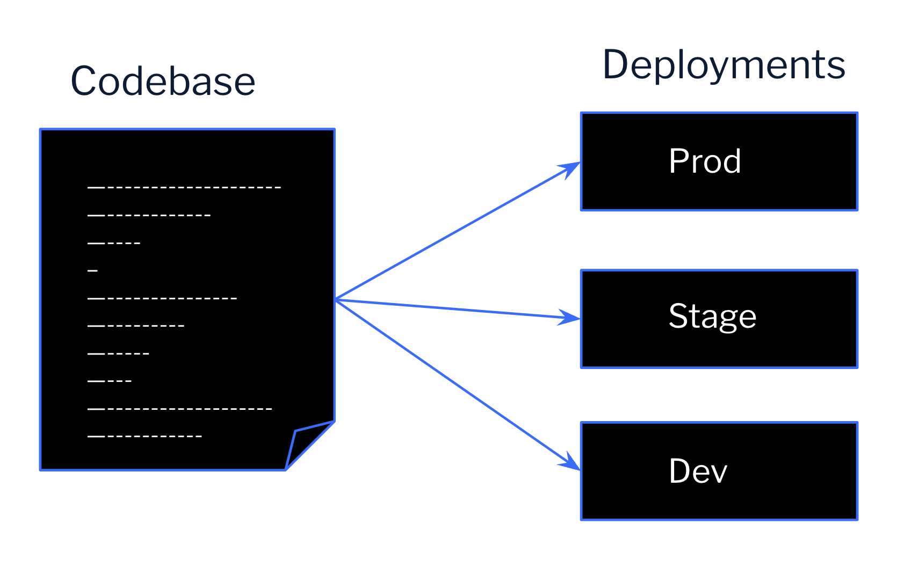
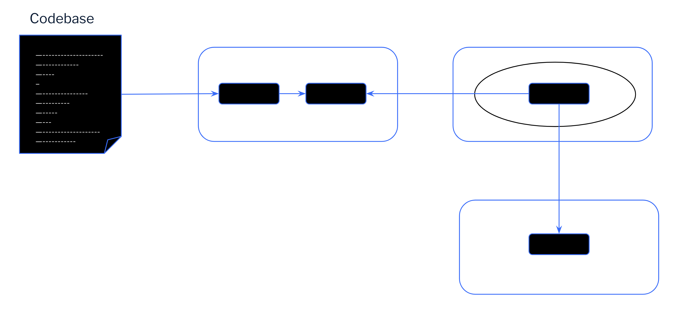

# Building Reliable and Scalable Applications: A Guide to 12-Factor Apps with Java and Spring Boot

Modern software demands robust, scalable apps. Enter 12-Factor Apps, your guide to building cloud-native champions.


Authors: Amith Kumar Madhusoodhanan
Date: unpublished
Category: backend

tags: 12-factor app, Java, Spring Boot, Cloud-native applications, DevOps, CI/CD, Microservices architecture, Docker, Containerization, Maven, Gradle, Configuration management, Dependency management, Backing services, Externalized configuration, Concurrency management, Logging, Monitoring, Scalability, Resilience

---
## What are 12-Factor Apps?

The 12-Factor App methodology, originally introduced by Heroku, outlines a set of guidelines for building applications that are:

  - **Portable**: Easy to deploy across different environments.
  - **Scalable**: Can readily scale up or down based on demand.
  - **Maintainable**: Simple to understand and modify.
  - **Disposable**: Can be easily restarted or replaced without impacting functionality.

Let's explore how to implement these principles using Java and Spring Boot:

---

### 1. Codebase

Maintain a single codebase for your application, typically stored in a centralized version control system like Subversion or decentralized version control system like Git. This ensures consistent code across development, staging, and production environments. 


Multiple apps should not share same codebase, rather shared code as libraries which can be added as [dependencies](#2-dependencies). In reality there can be multple deployments of an app from the same codebase, although code versions may differ in each deployment. 


### 2. Dependencies

Declare all dependencies explicitly and isolate dependencies in a manifest file like a Maven POM (pom.xml) or Gradle build script. This makes sure that the dependecies are pulled during build phase and the does not assume the dependencies to be present on the build system/runtime. This helps to provide consistency between development and production environments, simplifies the setup for developers new to the application, and supports portability between cloud platforms.

```xml
<project>
  <groupId>com.example</groupId>
  <artifactId>my-spring-boot-app</artifactId>
  <version>1.0.0</version>

  <dependencies>
    <dependency>
      <groupId>org.springframework.boot</groupId>
      <artifactId>spring-boot-starter-web</artifactId>
    </dependency>
    <!-- Add other dependencies here -->
    </dependencies>
</project>
```

### 3. Configuration

Store configuration details (database connection strings, API keys, and other [backing services](#4-backing-services)) outside your codebase as it is likely to vary between deployments(dev, stage, prod). Use environment variables to load configuration specific to each environment. Spring Boot allows for externalized configuration sources like property files and environment variables. Here's an example of configuring Backbase's user-manager service for [local development using docker-compose](https://github.com/Backbase/local-backend-setup/blob/main/development/docker-compose/docker-compose.yaml):
```yaml
user-manager:
    image: repo.backbase.com/backbase-docker-releases/user-manager:${BB_VERSION}
    ports:
      - "8060:8080"
    environment:
      <<: [*common-variables, *message-broker-variables, *database-variables]
      spring.datasource.url: jdbc:mysql://mysql:3306/user-manager?useSSL=false&allowPublicKeyRetrieval=true&cacheServerConfiguration=true&createDatabaseIfNotExist=true
      backbase.users.identity-endpoints-enabled: true
      backbase.users.identity-integration-enabled: true
      backbase.users.sync-primary-to-identity-enabled: true
      spring.cloud.discovery.client.simple.instances.user-integration-outbound-service[0].uri: http://wiremock:8080
    volumes:
      - ./exe/HealthCheck.jar:/tmp/HealthCheck.jar
    healthcheck:
      <<: *healthcheck-defaults
      test: [ "CMD", "java", "-jar", "-Xms5M", "-Xmx10M", "/tmp/HealthCheck.jar", "http://registry:8080/eureka/apps/user-manager", "<status>UP</status>" ]
    depends_on:
      mysql:
        condition: service_healthy
    links:
      - activemq
      - registry
```


### 4. Backing Services

Treat backing services (databases and other external services) as attached resources which can be accessed via a URL or credentials stored in the [config](#3-configuration). A deployment of the twelve-factor app should be able to swap out a local MySQL database with one managed by a third party (such as Azure SQL Database) without any changes to the app’s code. In Backbase we have helm charts which contains backing services configuations for all environments. This allows to deploy the application without making code change and re-packaging.


### 5. Build, Release, Run

Separate the build, release, and run stages. 
- **build**: Build automation tools like maven can pull the [dependencies](#2-dependencies) and package into a docker image which can be pushed to a docker repository.
- **release**: Combining the docker image generated from build process with the environment specific [configuration](#3-configuration) will produce a release and the release should be labelled with unique ID.
- **run**: The deployed app runs in an execution environment, by launching app's [process](#6-processes). A continous deployment tool like Argo CD, usually uses tooling like containers and processes to launch the application. Once that operation is running, the cloud runtime is responsible for its maintenance, health, and dynamic scaling.



### 6. Processes

Treat applications as a stateless processes and [share-nothing](http://en.wikipedia.org/wiki/Shared_nothing_architecture). Any data that needs to persist must be stored in a stateful [backing service](#4-backing-services), typically a database.
Applications build using REST as transport protocol using JAX-RS RESTful architecture are stateless. REST based microservices can scale up and down without losing any information. While designing REST applications "sticky sessions" (caching user session data in app memory) should not be used and it is a violation of twelve-factor. Session state data is a good candidate for a datastore that offers time-expiration, such as Memcached or Redis.

### 7. Port Binding
Bind applications to a port using environment variables. Spring Boot applications typically listen on a port defined in the application properties or environment variables.

Spring Boot allows configuring the port dynamically using environment variables. Below is an example configuration in `application.properties`:

```properties
# Server port
server.port=${PORT:8080}
```

### 8. Concurrency

Leverage process-based concurrency for scaling. Spring Boot applications can be easily deployed across multiple instances to handle increased traffic.


### 9. Disposability

Design applications to be fast to start and stop. Spring Boot applications typically have quick startup times, making them suitable for containerization.

Spring Boot applications can gracefully handle shutdown signals. You can perform cleanup tasks using `@PreDestroy` annotation:

```java
import javax.annotation.PreDestroy;
import org.springframework.stereotype.Component;

@Component
public class MyComponent {

    @PreDestroy
    public void cleanup() {
        // Cleanup tasks
    }
}
```

### 10. Dev/Prod Parity

Keep development, staging, and production environments as similar as possible to ensure that all potential bugs/failures can be identified in development and testing instead of when the application is put into production. By using environment variables and externalized configuration, you can achieve parity between environments.

Docker Containers enable the creation and use of the same image in development, staging, and production. It also helps to ensure that the same backing services are used in every environment. Utilizing this concept of containerization, testing tools like MicroShed Testing enable us to ensure that the testing environment is as close to production as possible, too.

### 11. Logs

Treat logs as event streams. Cloud-native applications can elastically scale from 1 to over 100 instances, which makes it difficult to track those instances and organize all of the logs. Spring Boot integrates seamlessly with logging frameworks like Logback, allowing you to centralize log collection and analysis using tools like (e.g., ELK stack, Splunk, Sumologic, etc.).

[Disposing](#9-disposability) an instance should not cause logs to vanish. Spring Boot uses SLF4J and Logback by default and helps to configure stdout and stderr logs. You can configure logging levels and appenders in `logback-spring.xml`:

```xml
<configuration>
    <root level="INFO">
        <appender-ref ref="CONSOLE" />
    </root>
</configuration>
```

### 12. Admin Processes

Run administrative tasks as one-off processes and they can be run as Kubernetes tasks. This factor discourages putting one-off admin or management tasks like migrating databases and running one-time scripts to do clean-up inside your microservices instead microservice should focus on business logic.

While running admin process make sure to run in an identical environment as the regular app. They should use the same [codebase](#1-codebase) and [config](#3-configuration) as the app to avoid synchronization issues.

Spring Boot applications can be extended with custom admin commands for specific tasks. Here's an example of a scheduled task in Spring Boot:

```java
import org.springframework.scheduling.annotation.Scheduled;
import org.springframework.stereotype.Component;

@Component
public class ScheduledTasks {

    @Scheduled(fixedRate = 10000)
    public void performDatabaseCleanup() {
        // Database cleanup task
    }
}
```

---

## Benefits of 12-Factor Apps:

  - **Increased Developer Productivity**: Consistent environments and clear separation of concerns make development and maintenance easier.
  - **Improved Scalability**: Stateless processes allow for easy scaling based on demand.
  - **Enhanced Portabilit**y: Applications can be deployed across different platforms with minimal changes.
  - **Simplified Maintainability**: Clear separation of code, configuration, and dependencies simplifies application management.

## Code Examples

Here's a simple Spring Boot application demonstrating some 12-Factor principles:

- [Backbase golden sample services](https://github.com/Backbase/golden-sample-services)

## References

- [12factor.net](https://12factor.net/)
- [IBM Developer](https://developer.ibm.com/articles/creating-a-12-factor-application-with-open-liberty/)
- [Redhat](https://www.redhat.com/architect/12-factor-app-containers)
- [Google cloud](https://cloud.google.com/architecture/twelve-factor-app-development-on-gcp)
