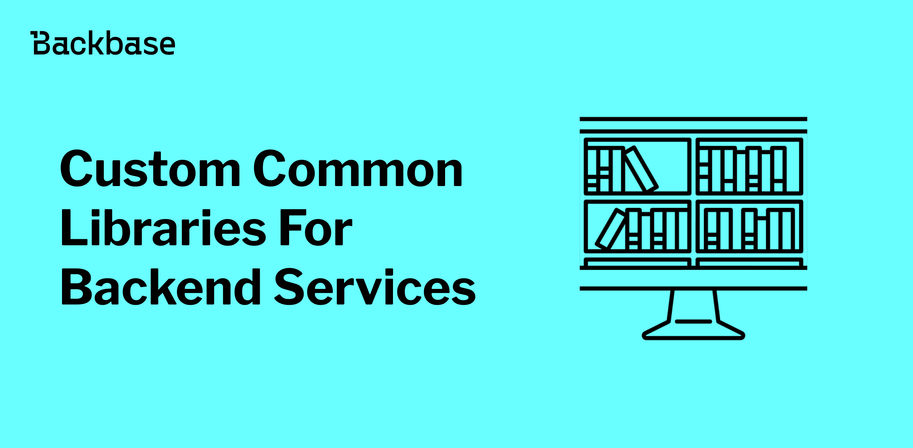
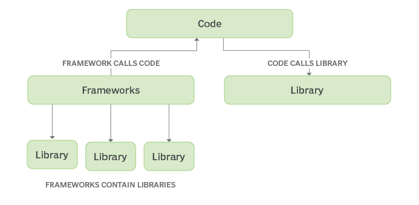
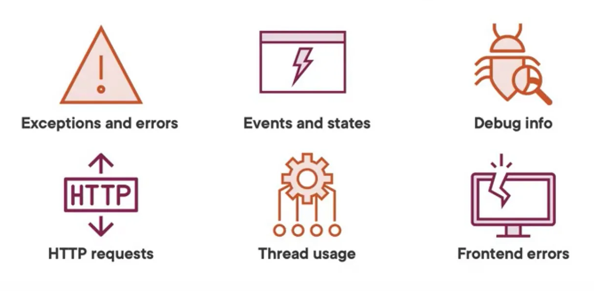

# Custom Common Libraries For Backend Services

Discover the best practices and considerations for commonizing aspects of software development, including custom libraries and business logic. Learn when commonization enhances efficiency and when customization is essential for project success.



Authors: Furkan Aksin
Date: unpublished
Category: backend

tags: custom, integration, services, commonize, backend, logging, error, handling, libraries, library

---

## **Introduction**

Common libraries are like toolboxes for developers, helping simplify tasks, reuse code, decrease code duplication, making projects consistent across multiple service aspects  and keep them organized. They're essential for making coding easier and projects more manageable.

In this post, we go through the importance of custom common libraries in backend development, exploring their benefits, structures, and considerations. We'll discuss common library structures, explore commonized capabilities beyond it, examine scenarios where common libraries may not be suitable, highlight the advantages of using custom libraries, and consider their disadvantages and key considerations. Finally, we'll conclude with insights on effectively leveraging custom common libraries in software development.

---
## **Why Custom Common Libraries?**

Before diving into the specifics of custom libraries, let's briefly explore why custom common libraries are valuable assets in modern development before diving into the details in next sections:

1. **Avoid Code Duplication**: By centralizing common functionalities in a custom library, developers can avoid duplicating code across projects.
2. **Consistency**: By encapsulating common logic within a reusable library, you ensure consistency across your projects. This consistency simplifies maintenance and reduces the likelihood of errors.
3. **Abstraction**: Libraries abstract away low-level implementation details, allowing developers to focus on business logic rather than intricate networking configurations.
4. **Flexibility**: Custom libraries can be tailored to suit the specific requirements of your project, offering a level of flexibility that generic solutions may lack.
5. **Enhanced Security**: Implementing standardized security measures within the library ensures that all API communications adhere to best practices, minimizing vulnerabilities.



---

## **Common Libraries Structures**

Custom libraries can be structured in various ways to organize their functionality effectively. For instance, they might follow a package naming convention like "com.example.custom" with subpackages such as "logging," "rest," and "tls," each handling specific functionalities. Alternatively, libraries could adopt a naming scheme like "example-captcha," and "example-communication," where each name reflects a distinct aspect or feature set of the library. The choice of structure depends on factors like the library's scope, the complexity of its functionalities, and the preferences of the development team.

#### ***First Approach Example***
```
.
└── com
    └── project
        └── custom
            └── src
                ├── main
                │   ├── java
                │   │   └── com
                │   │       └── example
                │   │           └── custom
                │   │               ├── logging
                │   │               │   └── ...
                │   │               ├── rest
                │   │               │   └── ...
                │   │               └── tls
                │   │                   └── ...
                │   └── resources
                │       └── ...
                └── test
                    └── ...
```

#### ***Second Approach Example***
```
.
└── example-events
├── example-captcha
├── example-communication
│   └── src
│       ├── main
│       │   ├── java
│       │   │   └── com
│       │   │       └── example
│       │   │           └── communication
│       │   │               ├── provider      # Provider classes
│       │   │               │   └── ...
│       │   │               ├── config        # Configuration classes
│       │   │               │   └── ...
│       │   │               ├── models        # Model classes
│       │   │               │   └── ...
│       │   └── resources                     # All resource files except core classes
│       │       └── ...
│       └── test                              # JUnit test files
│           └── ...
└── example-token

```


---
## **Beyond Common Libraries: Commonized Capabilities**

In addition to logging, timeout management, and TLS configuration, several other capabilities can be commonized in custom libraries. General error handling strategies, for instance, can be standardized to ensure consistent responses to various failure scenarios, enhancing robustness across services.

Furthermore, rate limiting and circuit breaking mechanisms can be integrated to manage service dependencies effectively and prevent cascading failures. Authentication and authorization mechanisms can also be abstracted to simplify integration with authentication providers and enforce access control policies consistently.

By encapsulating these common functionalities within custom libraries, developers can accelerate development, improve maintainability, and ensure adherence to best practices across their projects.

### **Areas of Common Libraries**

Let's say we're building a web application that needs to communicate with various external services, log important events, handle user authentication tokens, and manage event notifications. We can leverage common libraries for each of these tasks:

- **Communication:** We use a communication library to simplify making HTTP requests to external APIs. For example, we can use the library to send requests to a payment gateway or retrieve data from a third-party service.
  ```yaml
  # Communication Configuration
  communication:
    endpoint: "https://api.example.com"
    timeout: 5000
    headers:
      Content-Type: "application/json"
      Authorization: "Bearer {TOKEN}"
  ```

- **Logging:**  A logging library helps us track important events and debug issues in our application. For instance, we can use it to log user login attempts, errors encountered during API calls, or critical system events.
  ```yaml
  # Logging Configuration
  logging:
    level: "debug"
    format: "json"
    file_path: "/var/log/myapp.log"
  ```
- **Eventing:** Eventing libraries enable us to publish and subscribe to events within our application or across different services. We can use it to trigger actions based on user interactions, such as sending an email confirmation after a successful purchase or updating user preferences.
  ```yaml
  # Eventing Configuration
  eventing:
    topics:
      - name: "user_actions"
        description: "Events related to user actions"
        subscribers:
          - url: "https://webhook.example.com"
            auth:
              username: "user"
              password: "password"
    ```
- **Token Management:** With a token management library, we can securely generate, validate, and manage user authentication tokens. For instance, we can use it to issue JSON Web Tokens (JWTs) for user authentication or generate access tokens for API authorization.
  ```yaml
  # Token Management Configuration
  token_management:
    jwt:
      secret: "my_secret_key"
      expiry: 3600 # 1 hour
  ```

By incorporating these common libraries into our application, we simplify development, promote code reuse, and ensure consistency in how we handle communication, logging, eventing, and token management.

### **Release Cycle of Utility Libraries**

In managing utility libraries, sticking to a regular release schedule is important. Unlike integration services, these libraries can have their own release timetable. It's better not to use snapshot versions because they can cause problems. In using snapshot versions, it can lead to unpredictability and potential conflicts, making it harder for developers to maintain a stable environment. By keeping the release cycle separate from integration services, developers can avoid issues and adapt to changes more easily. This way, they can fix bugs and add new features without causing disruptions.

---
## **When Not to Use Common Libraries?**

Despite the benefits of common libraries, there are instances where specialized backend requirements warrant custom solutions. Here are scenarios where common libraries may not be the best fit:

- Highly specialized business logic needs
- Unique platform constraints
- API-specific error handling
- Performance optimization requirements
- Regulatory compliance demands


---
## **Advantages of Using Custom  Libraries**

The adoption of custom libraries offers several advantages and examples for them:

1. **Improved Productivity**: Streamlined integration processes reduce development time and effort, enabling teams to focus on core functionality and avoid such code duplications.
   - In a microservices-based platform, developers utilize a custom library to abstract away complexities of making API calls to various external services (e.g., payment gateways, inventory management systems, shipping providers). 
   - This abstraction allows for quick integration of services without manual implementation of communication logic, reducing development time and effort.
2. **Enhanced Maintainability**: Centralized communication logic simplifies maintenance tasks and promotes code reuse across projects.
   - If a software company develops multiple products requiring integration with third-party APIs (e.g., user authentication, email notifications, file storage).
   - By centralizing communication logic in a custom library, the company ensures consistency across all products, simplifying maintenance and promoting code reuse.
3. **Debugging and Monitoring**: Comprehensive logging capabilities facilitate debugging and monitoring of API interactions, aiding in troubleshooting.
   - An enterprise application interacts with various external APIs for processing orders, managing inventory, and generating reports.
   - Common library's logging capabilities provide detailed insights into request/response flows, timing, headers, payloads, and response statuses, aiding in debugging and monitoring efforts.
   - For instance, if an order fails, developers can analyze logs to identify issues with the API call and quickly resolve them.
4. **Scalability**: Custom libraries can be tailored to accommodate evolving project requirements and scale alongside the application.
   - A startup developing a mobile app connecting users with local service providers experiences growth in user base and features.
   - With common library, as API integrations become more numerous and complex, the library can scale alongside the application, accommodating evolving requirements efficiently.
5. **Security**: Built-in security features ensure secure communication with external APIs, mitigating risks associated with data breaches and unauthorized access.
   - In a financial application handling sensitive user data, a custom communication library ensures secure communication with external banking APIs.
   - The library's built-in security features, such as TLS encryption and certificate validation, safeguard against data breaches and unauthorized access, maintaining the integrity and confidentiality of user information.

## **Disadvantages and Considerations**

While custom libraries offer numerous benefits, it's essential to consider potential drawbacks:

1. **Dependency Management**: Introducing additional dependencies increases the complexity of the project's dependency tree and requires careful management.
2. **Learning Curve**: Developers unfamiliar with the custom library may require time to understand its implementation and configuration.

---
## **Conclusion**

In the realm of software integration, effective communication is paramount. Custom libraries streamline the integration process, offering a robust foundation for building reliable and secure connections with external APIs. By leveraging the features and flexibility of custom libraries, developers can accelerate development, enhance maintainability, and ensure seamless interoperability across their projects.

---
