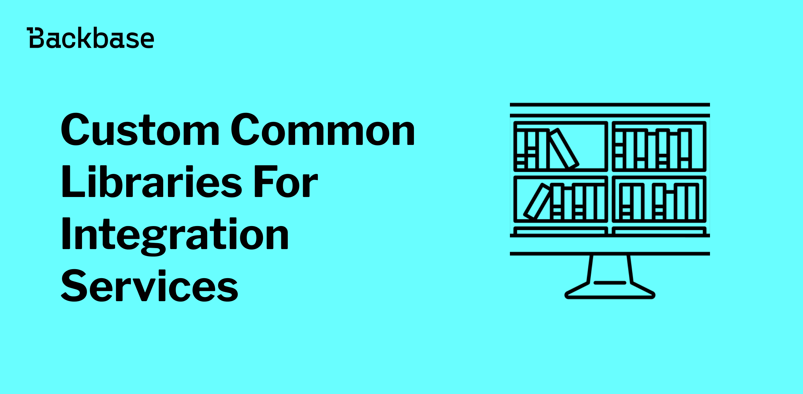
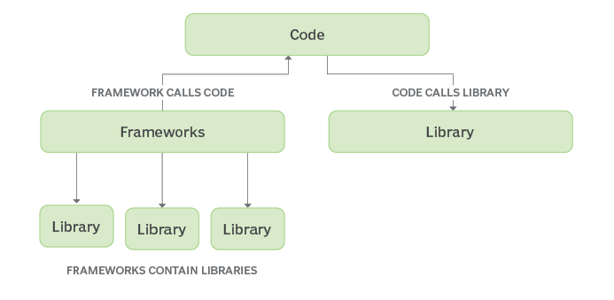
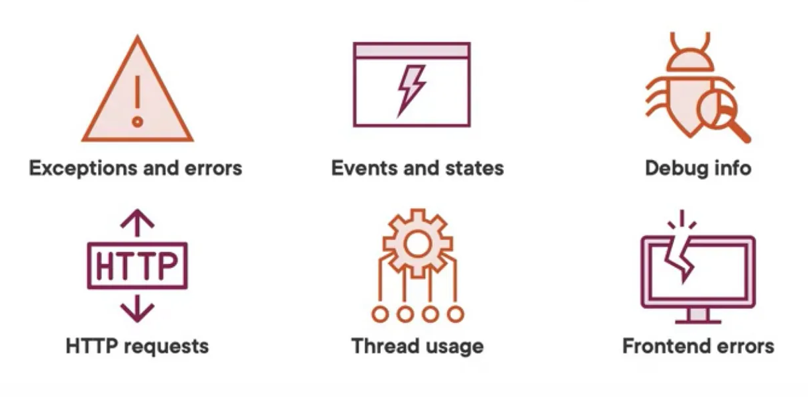

# Custom Common Libraries For Integration Services

Discover the best practices and considerations for commonizing aspects of software development, including communication libraries, business logic and error handling. Learn when commonization enhances efficiency and when customization is essential for project success.



Authors: Furkan Aksin
Date: unpublished
Category: backend

tags: custom, communication, integration, services, commonize, backend, logging, error, handling, libraries, library

---

## **Introducing Communication Libraries**

In the ever-expanding landscape of software development, effective communication between different services and systems is crucial. Integrating external APIs into your projects often presents challenges, from handling request/response logging to managing timeouts and ensuring secure connections. This is where custom communication libraries come into play, providing a tailored solution for seamless integration.
---
## **Why Custom Communication Libraries?**

Before diving into the specifics of communication libraries, let's briefly explore why custom communication libraries are valuable assets in modern development:

1. **Consistency**: By encapsulating communication logic within a reusable library, you ensure consistency across your projects. This consistency simplifies maintenance and reduces the likelihood of errors.
2. **Abstraction**: Libraries abstract away low-level implementation details, allowing developers to focus on business logic rather than intricate networking configurations.
3. **Flexibility**: Custom libraries can be tailored to suit the specific requirements of your project, offering a level of flexibility that generic solutions may lack.
4. **Enhanced Security**: Implementing standardized security measures within the library ensures that all API communications adhere to best practices, minimizing vulnerabilities.



---
## **Introducing CS Communication Library**

CS Communication Library is a versatile solution designed to facilitate communication with external APIs in Spring-based services. Leveraging Apache HTTP Client, this library simplifies the process of creating and managing REST templates for making API calls.

### **Features**:

- **RestTemplate Creation**: Simplified creation of RestTemplate instances using Apache HTTP Client.
- **Request/Response Logging**: Comprehensive logging of request and response details, including headers, URIs, payloads, and response statuses.
- **Time Measurement**: Measurement of the time taken for RestTemplate calls, aiding in performance monitoring and optimization.
- **Configurability**: Flexible configurations for enabling/disabling logging, adjusting timeouts, and enabling TLS certificate-based requests.

### **How to Use It**:

Using CS Communication Library in your project is straightforward:

1. **Add Dependency**: Include the library as a dependency in your project.
2. **Configuration**: Import the library's configuration class and inject the provided RestTemplateProvider.
3. **Custom RestTemplate**: Expose the custom RestTemplate bean in your configuration class, optionally customizing it as needed.
4. **Integration**: Utilize the RestTemplate bean in your API client classes to make external API calls effortlessly.

```java
// Step 1: Add Dependency
<dependency>
   <groupId>com.backbase.custom</groupId>
   <artifactId>cs-communication</artifactId>
   <version>${cs-communication.version}</version>
</dependency>

// Step 2: Import Configuration
@Import(CustomCommunicationConfiguration.class)
public class ExperienceApiConfiguration {
}

// Step 3: Inject RestTemplateProvider
@Autowired
private RestTemplateProvider restTemplateProvider;

// Step 4: Expose Custom RestTemplate
@Qualifier("ssbRestTemplate")
@Bean
public RestTemplate ssbRestTemplate() {
    return restTemplateProvider.createTraceableRestTemplate(null);
}

// Step 5: Use RestTemplate in API Client
@Bean
public ApiClient apiClient() {
    var apiClient = new ApiClient(ssbRestTemplate());
    return apiClient;
}
```

### Configurations and Flexibility

CS Communication Library provides extensive configurations to tailor its behavior to your project's requirements:

- **Logging Configuration**: Fine-grained control over logging settings, including enabling/disabling logging, specifying log formats, and setting payload size limits.
- **Timeout Configuration**: Adjustable timeouts for reading, connecting, and requesting connections, allowing for optimized network performance.
- **TLS Configuration**: Flexible TLS configurations for enabling certificate-based requests, verifying hostnames, and specifying keystore/truststore paths and passwords.

---
## **Beyond CS Communication Library: Commonized Capabilities**

In addition to logging, timeout management, and TLS configuration, several other capabilities can be commonized in custom communication libraries. General error handling strategies, for instance, can be standardized to ensure consistent responses to various failure scenarios, enhancing robustness across services.

Furthermore, rate limiting and circuit breaking mechanisms can be integrated to manage service dependencies effectively and prevent cascading failures. Authentication and authorization mechanisms can also be abstracted to simplify integration with authentication providers and enforce access control policies consistently.

By encapsulating these common functionalities within custom communication libraries, developers can accelerate development, improve maintainability, and ensure adherence to best practices across their projects.

### **Release Cycle of Utility Libraries**

In managing utility libraries like custom communication tools, sticking to a regular release schedule is important. Unlike integration services, these libraries can have their own release timetable. It's better not to use snapshot versions because they can cause problems. In using snapshot versions, it can lead to unpredictability and potential conflicts, making it harder for developers to maintain a stable environment. By keeping the release cycle separate from integration services, developers can avoid issues and adapt to changes more easily. This way, they can fix bugs and add new features without causing disruptions.

---
## **When Not to Use Common Libraries?**

Avoid commonizing business logic implementation and UI/UX design components when the requirements are highly specialized or unique to specific domains or platforms. Attempting to generalize intricate business rules and workflows, as well as UI elements, may lead to unnecessary complexity and reduced flexibility, potentially resulting in suboptimal outcomes. Similarly, specific error handling for each API should not be commonized, as logging and error reporting may vary significantly depending on the API's behavior and requirements. Instead, prioritize clarity, adaptability, and creativity by tailoring business logic, UI/UX design, and error handling strategies to the unique needs of each project, ensuring an effective, user-friendly, and robust solution.


---
## **Advantages of Using Custom Communication Libraries**

The adoption of custom communication libraries like CS Communication offers several advantages:

1. **Improved Productivity**: Streamlined integration processes reduce development time and effort, enabling teams to focus on core functionality.
2. **Enhanced Maintainability**: Centralized communication logic simplifies maintenance tasks and promotes code reuse across projects.
3. **Debugging and Monitoring**: Comprehensive logging capabilities facilitate debugging and monitoring of API interactions, aiding in troubleshooting.
4. **Scalability**: Custom libraries can be tailored to accommodate evolving project requirements and scale alongside the application.
5. **Security**: Built-in security features ensure secure communication with external APIs, mitigating risks associated with data breaches and unauthorized access.

## **Disadvantages and Considerations**

While custom communication libraries offer numerous benefits, it's essential to consider potential drawbacks:

1. **Dependency Management**: Introducing additional dependencies increases the complexity of the project's dependency tree and requires careful management.
2. **Learning Curve**: Developers unfamiliar with the custom library may require time to understand its implementation and configuration.

---
## **Conclusion**

In the realm of software integration, effective communication is paramount. Custom communication libraries like CS Communication streamline the integration process, offering a robust foundation for building reliable and secure connections with external APIs. By leveraging the features and flexibility of custom libraries, developers can accelerate development, enhance maintainability, and ensure seamless interoperability across their projects.

---
