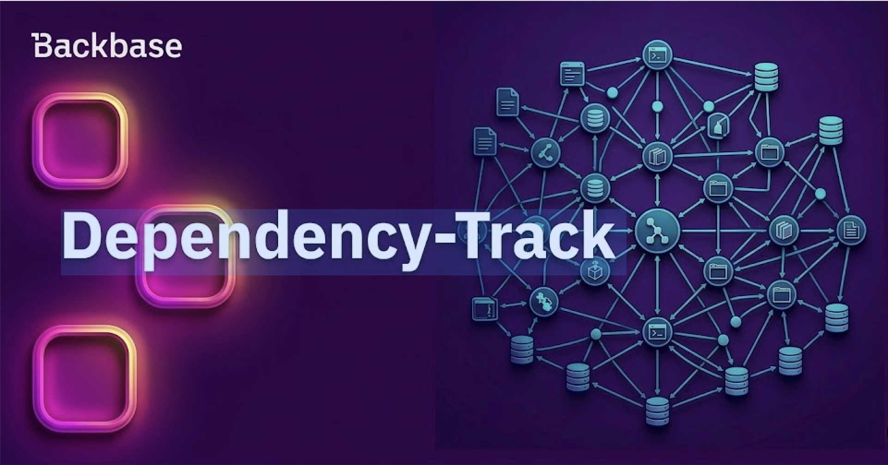
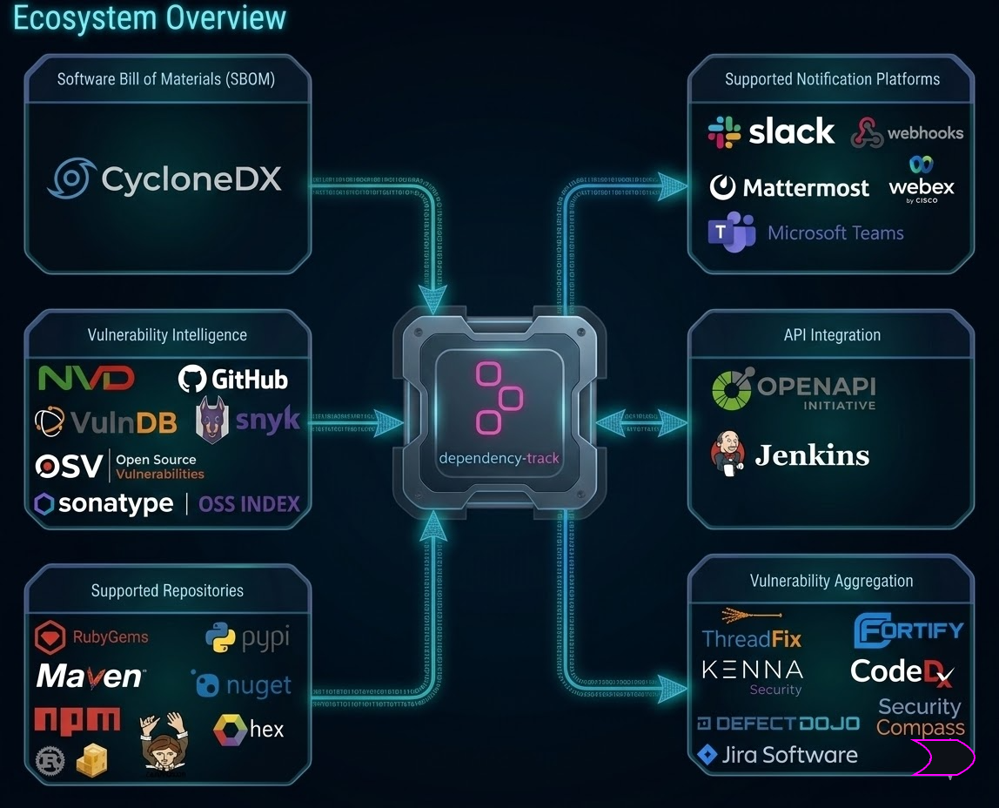
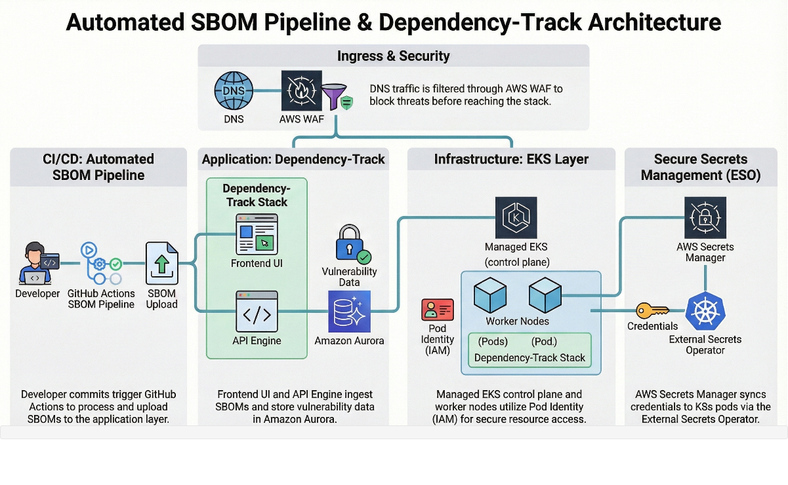
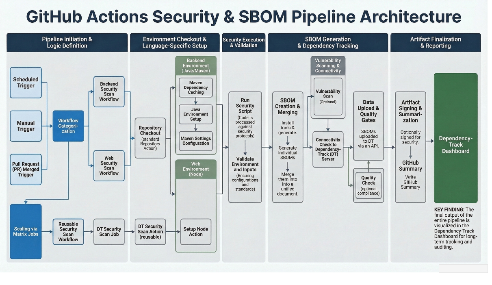

# Dependency-Track

Secure the Future of Your Software Supply Chain with OWASP Dependency-Track



Authors: Sridhar Modalavalasa
Date: unpublished
Category: devops

tags: dependency-track, devsecops, appsec, sbom, supply chain security

---

## Automating software supply chain security: SBOM uploads to Dependency-Track on EKS

## Problem statement

Modern applications within the **SCM Platforms** organizations rely on thousands of third-party libraries. As the ecosystem scales to 200+ repositories, several critical challenges have emerged:

* **Security risks:** unpatched libraries and compromised upstream dependencies expose apps to known exploits and supply chain attacks.
* **Compliance gaps:** regulatory mandates now require the generation and continuous tracking of a Software Bill of Materials (SBOM).
* **Operational inefficiency:** manual dependency reviews and license auditing have become unsustainable, consuming significant security team effort.
* **Licensing costs:** commercial SCA solutions often incur high per-repository or per-user licensing overhead that does not align with the current scaling model.

This led to deploying **Dependency-Track 4.13.5+** on **Amazon EKS** as the centralized SCA platform.

## The why: understanding SBOM and Dependency-Track

Before diving into the architecture, here are the core components of this system.

### What is an SBOM?
A Software Bill of Materials (SBOM) is effectively a "nutrition label" for software. A nested inventory, it lists all the ingredients—the open source and third-party components, libraries, and dependencies—used to build an app. This transparency is the foundation of software supply chain security.

### What is Dependency-Track?
Dependency-Track is an intelligent Component Analysis platform that takes these SBOMs and turns them into actionable intelligence.
- **Continuous monitoring:** it ingests SBOMs and continuously monitors components against several vulnerability databases (NVD, OSS Index, GitHub Advisories).
- **Risk analysis:** it analyzes the entire dependency graph to calculate a Bill of Materials Health (BCV) score and rank remediation efforts.
- **Policy enforcement:** it enables defining and enforcing security and license policies across projects.




## Key implementation pillars

- **Centralized infra:** one EKS instance (dedicated namespace) with Aurora PostgreSQL for the whole org
- **Performance:** split repositories into batches with staggered run times to reduce load on the single API server
- **Three-tier workflow:**
  1. **Tier 1—local:** repo-level trigger in .github/ directory as a workflow.
  2. **Tier 2—common:** shared orchestration in one common shared repository which is a reusable action.
  3. **Tier 3—logic:** portable security.sh for SBOM creation and upload
- **Multi-stack support:** java (Maven), Python, web (NPM), mobile (Trivy), Docker

## Architecture overview: the big picture

Three robust pillars underpin the solution: the **Infrastructure** (EKS), the **Application** (Dependency-Track), and the **Pipeline** (GitHub Actions). The following diagram illustrates how these pieces interact.



The architecture automates the ingestion and analysis of **Software Bill of Materials (SBOM)** data, ensuring that every code commit undergoes security scrutiny.

### Key components
* **CI/CD integration:** GitHub Actions automates SBOM generation and upload upon developer code commits.
* **Orchestration layer:** hosted on **Amazon EKS**, utilizing specialized Kubernetes pods for the user interface (UI) and vulnerability analysis.
* **Security and traffic control:** **AWS WAF** filters incoming traffic, protecting the Dependency-Track API and UI.
* **Secret management:** an **External Secrets Operator** synchronizes sensitive credentials directly from **AWS Secrets Manager** into the Kubernetes cluster.
* **Data persistence:** **Amazon Aurora** serves as a secured, high-availability storage layer for vulnerability data and project history.
* **Access control:** fine-grained **IAM Roles** manage permissions for the underlying EKS infrastructure and AWS service interactions.

## Deep dive: the infrastructure layer (EKS)

The Dependency-Track platform is fully managed within the existing EKS ecosystem, ensuring scalability, resilience, and security.

### 4.1 Application deployment
**Helm Releases**, managed by **OpenTofu** (Terraform) pipelines, deploy the app. This ensures a repeatable and version-controlled deployment.
- **Frontend pods:** serve the Dependency-Track user interface.
- **API server pods:** handle REST API requests, including SBOM uploads.
- **Database:** a highly available **Aurora PostgreSQL** instance provides persistent storage for projects, findings, and metrics.

### 4.2 Ingress and traffic flow
Several layers secure and route all external traffic:
- **DNS** points to the **Application Load Balancer (ALB)**.
- A **Web Application Firewall (WAF)** protects the ALB by filtering out common web exploits.
- The ALB terminates SSL/TLS and forwards traffic to the **Frontend Pods**.
- Frontend pods communicate internally with the API Server Pods, which connect securely to the **Aurora PostgreSQL** database.


### 4.3 Secure secrets management with ESO
Credentials are never hardcoded. The flow for managing secrets like database passwords and API keys follows a secure, GitOps-friendly pattern:

1.  **Source of truth:** **AWS Secrets Manager** stores and manages all secrets.
2.  **Synchronization:** the **External Secrets Operator (ESO)** running in the cluster watches for **External Secret** resources.
3.  **Kubernetes secret creation:** ESO fetches values from AWS and creates standard **Kubernetes Secrets**.
4.  **Pod consumption:** the frontend and API server pods use **EKS Pod Identity** to assume specific IAM roles, granting access to the necessary secrets and nothing else. This eliminates the need for long-lived credentials in the cluster.

### 4.4 Helm values that matter in production
The values template used by the EKS module controls the deployment. The following examples are the most useful knobs to call out for platform teams.

#### API Server hardening and persistence
This values segment captures the core runtime guardrails for the API server.

```yaml
apiServer:
  deploymentType: StatefulSet
  resources:
    requests:
      cpu: 500m
      memory: 1Gi
    limits:
      cpu: 2000m
      memory: 4Gi
  podSecurityContext:
    fsGroup: 1000
  securityContext:
    allowPrivilegeEscalation: false
    capabilities:
      drop: [ALL]
    runAsNonRoot: true
    runAsUser: 1000
    runAsGroup: 1000
    readOnlyRootFilesystem: true
    seccompProfile:
      type: RuntimeDefault
  persistentVolume:
    enabled: true
    className: gp2
    size: 50Gi
```

This gives stable API pod identity, explicit CPU/memory control, and a restricted runtime posture by default.

#### External Aurora database wiring through Kubernetes secrets
The API server reads database connection properties from Kubernetes Secrets synced by ESO.

```yaml
apiServer:
  extraEnv:
    - name: ALPINE_DATABASE_MODE
      value: external
    - name: ALPINE_DATABASE_URL
      valueFrom:
        secretKeyRef:
          name: aurora-rds-connection
          key: jdbcUrl
    - name: ALPINE_DATABASE_USERNAME
      valueFrom:
        secretKeyRef:
          name: aurora-rds-connection
          key: username
    - name: ALPINE_DATABASE_PASSWORD
      valueFrom:
        secretKeyRef:
          name: aurora-rds-connection
          key: password
    - name: ALPINE_DATABASE_POOL_MAX_SIZE
      value: "20"
    - name: ALPINE_DATABASE_POOL_MIN_IDLE
      value: "10"
```

This keeps credentials out of manifests and allows tuning connection pool behavior for higher import throughput.

#### Node placement and ingress model
The following settings keep workloads on dedicated nodes and expose the service through ALB.

```yaml
apiServer:
  tolerations:
    - effect: NoSchedule
      key: dependency-track
      operator: Exists
  nodeSelector:
    managed: "true"
    node-role: system
    node-type: managed
    node-group-name: dependency-track-nodegroup

ingress:
  enabled: true
  ingressClassName: alb
  annotations:
    alb.ingress.kubernetes.io/scheme: internet-facing
    alb.ingress.kubernetes.io/target-type: ip
    external-dns.alpha.kubernetes.io/hostname: dependency-track.org.in
```

This isolates Dependency-Track workloads onto designated nodes and standardizes ALB plus ExternalDNS integration.

### 4.5 Health probes and JVM tuning

Comprehensive health checks and performance tuning optimize the API server for SBOM ingestion workloads.

#### Health probe configuration

```yaml
apiServer:
  probes:
    startup:
      path: "/health/started"
      failureThreshold: 60
      initialDelaySeconds: 120
      periodSeconds: 10
    liveness:
      path: "/health/live"
      failureThreshold: 5
      initialDelaySeconds: 120
    readiness:
      path: "/health/ready"
      failureThreshold: 5
      initialDelaySeconds: 120
```

The generous **initialDelaySeconds** (120 s) accommodates the API server's startup time, during initial database migrations and vulnerability feed synchronization. The high **failureThreshold** on startup (60) prevents premature pod restarts during first-time initialization.

#### JVM tuning for large SBOM ingestion

```yaml
extraEnv:
  - name: JAVA_OPTS
    value: "-Xms4g -Xmx4g -XX:+UseG1GC -XX:MaxGCPauseMillis=200 -Djava.security.egd=file:/dev/./urandom"
```

- **Fixed heap sizing** (-Xms4g -Xmx4g): prevents heap resizing overhead during bulk uploads
- **G1GC with 200 ms pause target**: ensures responsive API behavior during concurrent SBOM uploads
- **Entropy source override**: improves startup time in containerized environments

## Deep dive: the automation layer (GitHub Actions)

The magic happens in the GitHub Actions pipelines, which automate the entire SBOM lifecycle from code commit to security analysis.

### 5.1 Pipeline triggers
The pipelines support three trigger modes:
- **Schedule:** automated daily or weekly scans to catch new vulnerabilities in existing dependencies.
- **Manual:** on-demand execution for ad-hoc analysis or testing.
- **Pull request:** automatic SBOM generation and upload for PRs, allowing teams to "shift left" and see the security impact of a change before it merges.

### 5.2 The SBOM upload pipeline

The security scanning pipeline follows a six-stage workflow:

1. **Environment setup**—checkout source and configure language-specific tooling (Node.js, Java, Python, etc.)
2. **SBOM generation**—produce standardized CycloneDX inventories using ecosystem-native tools
3. **Pre-upload validation**—security scan and format verification before external transmission
4. **Connectivity verification**—authenticate with Dependency-Track API and verify network path
5. **SBOM ingestion**—upload to Dependency-Track for asynchronous vulnerability analysis
6. **Observability**—surface execution metrics directly in GitHub Actions UI

The following architecture illustrates the GitHub Actions pipeline structure and the specific implementation steps integrated into the workflow.



### Multi-stack generation strategy

A single SBOM creation strategy covers six technology stacks without sacrificing ecosystem-specific optimizations:

| Stack | Tool | Key Configuration |
|-------|------|-------------------|
| Java/Maven | **cyclonedx-maven-plugin** | Aggregated BOM across all modules; test scope excluded |
| Python | **cyclonedx-py** | Auto-detects Pipfile, requirements.txt, or Poetry |
| Node.js | **@cyclonedx/cyclonedx-npm** | Production-only (--omit dev); lockfile-enforced |
| Android/Gradle | **@cyclonedx/cdxgen** | Gradle configuration analysis |
| iOS | **cyclonedx-cocoapods** | CocoaPods dependency tree |
| Containers | **trivy image** | Layer-by-layer image analysis |

The generation logic uses a portable bash function that dispatches to the appropriate tool based on project type:

```bash
generateSBOM(){
  info "Generating SBOM for ${name} (${version})"
  cd "$sourcePath"
  
  case ${type} in
    docker)
      trivy image --format cyclonedx --output bom.json "${REGISTRY:-}${name}:${version}"
      ;;
    web)
      [ -f package-lock.json ] || npm install
      npx --yes @cyclonedx/cyclonedx-npm \
        --output-format JSON \
        --omit dev \
        --package-lock-only \
        --output-file bom.json
      ;;
    backend-python)
      if   [ -f Pipfile.lock ];    then cyclonedx-py -pip --format json -o bom.json
      elif [ -f requirements.txt ]; then cyclonedx-py -r --format json -o bom.json
      elif [ -f poetry.lock ];      then cyclonedx-py -p --format json -o bom.json
      fi
      ;;
    backend)
      ${MVN_COMMAND} org.cyclonedx:cyclonedx-maven-plugin:makeAggregateBom \
        -DoutputFormat=json \
        -DincludeTestScope=false  # Exclude test dependencies
      mv target/bom.json bom.json
      ;;
  esac
  
  # Fail fast on malformed JSON
  jq -e . < bom.json >/dev/null 2>&1 || true
}
```

**Design decisions worth noting:**
- **Production-only scope**—dev dependencies and test-scoped libraries don't ship to production, so excluding them reduces noise
- **Lockfile enforcement**—guarantees reproducible SBOMs across environments
- **Validation**—a **jq** syntax verification prevents uploading malformed JSON to Dependency-Track

### Handling complex project boundaries

Microservices often span several artifact types—app code plus container images. The pipeline supports merging several SBOMs into a unified dependency graph:

```bash
mergeSBOMsIfPresent(){
  if [ -d "${sourcePath}/sbom" ] || [ -s "${sourcePath}/bom-docker.json" ]; then
    info "Merging multiple SBOMs"
    mkdir -p "${sourcePath}/__merge__"
    
    # Collect component SBOMs
    [ -d "${sourcePath}/sbom" ] && cp ${sourcePath}/sbom/*.json "${sourcePath}/__merge__/"
    [ -s "${sourcePath}/bom.json" ] && cp "${sourcePath}/bom.json" "${sourcePath}/__merge__/"
    [ -s "${sourcePath}/bom-docker.json" ] && cp "${sourcePath}/bom-docker.json" "${sourcePath}/__merge__/"
    
    # Flatten into single artifact
    docker run --rm -v "${sourcePath}/__merge__:/sbom" \
      cyclonedx/cyclonedx-cli:latest merge \
      --input-files /sbom/*.json \
      --output-file /sbom/_merged.json
    
    mv "${sourcePath}/__merge__/_merged.json" "${sourcePath}/bom.json"
    rm -rf "${sourcePath}/__merge__"
  fi
}
```

This enables teams to track both app vulnerabilities and base image CVEs within a single Dependency-Track project view.

### 5.3 Reusable workflow and caller pattern

A three-tier pattern removes workflow duplication across repositories:

**Tier 1: repository caller**—defines branch matrix and trigger conditions  
**Tier 2: reusable workflow**—centralized security scanning logic  
**Tier 3: portable scripts**—SBOM generation and upload utilities

#### The reusable workflow contract

```yaml
name: Security Scan

on:
  workflow_call:
    inputs:
      dt-project-type:
        type: string
        required: true
      dt-project-name:
        type: string
        required: true
      dt-project-version:
        type: string
        required: true
      # ... additional configuration

jobs:
  dt-security-scan:
    runs-on: ubuntu-latest
    
    steps:
      # Conditional stack setup
      - name: Setup Java
        if: ${{ inputs.dt-project-type == 'backend' }}
        uses: ./.github/actions/setup-java
        
      - name: Setup Node.js
        if: ${{ inputs.dt-project-type == 'web' }}
        uses: ./.github/actions/setup-node
        
      # Unified execution
      - name: Run Security Scan
        uses: ./.github/actions/dt-security
        with:
          name: ${{ inputs.dt-project-name }}
          version: ${{ inputs.dt-project-version }}
          type: ${{ inputs.dt-project-type }}
```

This pattern yields measurable benefits:
- **Single source of truth**—updates propagate to 200+ repositories automatically
- **Conditional execution**—jobs skip irrelevant setup steps, cutting runtime by ~40% for pure Node.js or Java projects
- **Flexible authentication**—Maven and NPM credentials are optional; same workflow handles both ecosystems

#### Intelligent branch targeting

The caller workflow dynamically computes scan targets based on trigger context:

```yaml
define-matrix:
  runs-on: ubuntu-latest
  outputs:
    branches: ${{ steps.set-targets.outputs.branches }}
  steps:
    - id: set-targets
      run: |
        BRANCHES="[]"
        TRIGGER="${{ github.event_name }}"

        if [[ "$TRIGGER" == "schedule" ]]; then
          BRANCHES='["develop"]'  # Daily monitoring
        
        elif [[ "$TRIGGER" == "workflow_dispatch" ]]; then
          INPUT="${{ github.event.inputs.branch }}"
          BRANCHES="[\"${INPUT:-${{ github.ref_name }}}\"]"
        
        elif [[ "$TRIGGER" == "pull_request" ]]; then
          # Only scan master for production-bound merges
          if [[ "${{ github.event.pull_request.merged }}" == "true" ]]; then
            HEAD="${{ github.event.pull_request.head.ref }}"
            [[ "$HEAD" == release/* || "$HEAD" == hotfix/* ]] && BRANCHES='["master"]'
          fi
        fi

        echo "branches=$BRANCHES" >> "$GITHUB_OUTPUT"
```

| Trigger | Target | Rationale |
|---------|--------|-----------|
| Scheduled | **develop** | Continuous monitoring of active development |
| Manual | User-defined | Ad-hoc analysis for debugging or validation |
| PR Merge | **master** (conditional) | Release gate for production-bound code |

#### API integration: lessons learned

The Dependency-Track upload endpoint has specific requirements that caused initial friction. A two-phase approach addresses this:

**Phase 1: connectivity validation**
```bash
checkConnection(){
  local url="${DT_PROTOCOL}://${DT_HOST}/api/version"
  
  local args=(
    -sS -f -X GET "$url"
    -H "X-Api-Key: ${DT_API_KEY}"
    -m 10  # Aggressive timeout for fast failure
  )
  
  # WAF bypass support for restricted networks
  [ -n "${DT_CUSTOM_HEADER_VALUE:-}" ] && \
    args+=(-H "${DT_CUSTOM_HEADER_NAME}: ${DT_CUSTOM_HEADER_VALUE}")

  http_code=$(curl -w "\n%{http_code}" "${args[@]}" 2>&1 | tail -n1)
  [ "$http_code" == "200" ] || error "API unreachable (HTTP ${http_code})"
}
```

**Phase 2: multipart upload**
```bash
curl_dt_upload(){
  local url="${DT_PROTOCOL}://${DT_HOST}/api/v1/bom"
  
  # Critical: multipart/form-data, NOT application/json
  curl -sS -f -X POST "$url" \
    -H "X-Api-Key: ${DT_API_KEY}" \
    -F "projectName=$name" \
    -F "projectVersion=$version" \
    -F "autoCreate=true" \
    -F "bom=@bom.json"  # @ prefix required for file upload
}
```

**Critical implementation detail:** the Dependency-Track **/api/v1/bom** endpoint requires **multipart/form-data** encoding. Using **-d** (JSON payload) or setting **Content-Type: application/json** results in HTTP 415 errors. The **-F** flag and **@bom.json** syntax are non-negotiable.

#### Observability by design

The pipeline surfaces execution state directly in GitHub Actions using job summaries:

```bash
# State tracking
EXIT_STATUS="Success"
UPLOAD_STATUS="Skipped ⏭️"

# Guaranteed execution on script termination
trap write_summary EXIT

write_summary(){
  local icon="✅"; [ "$EXIT_STATUS" != "Success" ] && icon="❌"
  
  echo "### Dependency-Track Execution Summary" >> $GITHUB_STEP_SUMMARY
  echo "| Metric | Value |" >> $GITHUB_STEP_SUMMARY
  echo "|--------|-------|" >> $GITHUB_STEP_SUMMARY
  echo "| **Status** | ${icon} ${EXIT_STATUS} |" >> $GITHUB_STEP_SUMMARY
  echo "| **Project** | \`${name}\` |" >> $GITHUB_STEP_SUMMARY
  echo "| **Version** | \`${version}\` |" >> $GITHUB_STEP_SUMMARY
  echo "| **Upload** | ${UPLOAD_STATUS} |" >> $GITHUB_STEP_SUMMARY
}
```

The **trap** ensures summaries generate even on script failure, eliminating silent failures in CI logs.

### 5.4 Workflow improvements to consider
- Pin reusable workflows and actions to version tags or commit SHAs instead of floating main for better supply chain control.
- Add job-level timeout values to prevent long-running scans from consuming runners indefinitely.
- Upload bom.json as a build artifact for post-failure debugging and audit evidence.
- Add lightweight concurrency controls so repeated manual runs do not flood the single Dependency-Track API server.
- Keep staggered cron schedules for backend and web repositories to flatten ingestion spikes against a shared backend.
- Introduce branch-to-environment naming conventions for project version values so trending and cleanup become easier.


## Conclusion and next steps

The implementation of this automated SBOM pipeline marks a significant step forward in DevSecOps maturity. By leveraging GitHub Actions and a self-hosted Dependency-Track instance on EKS, the team has created a closed-loop system for managing software risk.

**What this means for your team:**
- **Visibility:** every team can now see what's in their apps.
- **Proactive security:** the pipeline catches vulnerabilities earlier in the development cycle.
- **Compliance:** the organization is better positioned to meet evolving software supply chain security regulations.


## References

Official documentation links used for this implementation:

### Dependency-Track and SBOM
- [Dependency-Track Official Documentation](https://docs.dependencytrack.org/)
- [Dependency-Track: deploying on Kubernetes](https://docs.dependencytrack.org/getting-started/deploy-kubernetes/)
- [Dependency-Track REST API Documentation](https://docs.dependencytrack.org/integrations/rest-api/)
- [Dependency-Track Helm Chart (Official)](https://github.com/DependencyTrack/helm-charts/tree/main/charts/dependency-track)
- [CycloneDX Specification Overview](https://cyclonedx.org/specification/overview/)

### Amazon EKS and AWS integrations
- [Amazon EKS User Guide](https://docs.aws.amazon.com/eks/latest/userguide/what-is-eks.html)
- [Amazon EKS Pod Identity](https://docs.aws.amazon.com/eks/latest/userguide/pod-identities.html)
- [AWS Load Balancer Controller Docs](https://kubernetes-sigs.github.io/aws-load-balancer-controller/latest/)
- [ExternalDNS Documentation](https://kubernetes-sigs.github.io/external-dns/latest/)
- [External Secrets Operator Documentation](https://external-secrets.io/latest/)
- [AWS Secrets Manager Documentation](https://docs.aws.amazon.com/secretsmanager/latest/userguide/intro.html)

### GitHub Actions workflow references
- [GitHub Actions: reuse workflows](https://docs.github.com/en/actions/how-tos/reuse-automations/reuse-workflows)
- [GitHub Actions: matrix strategy](https://docs.github.com/en/actions/how-tos/write-workflows/choose-what-workflows-do/run-job-variations)