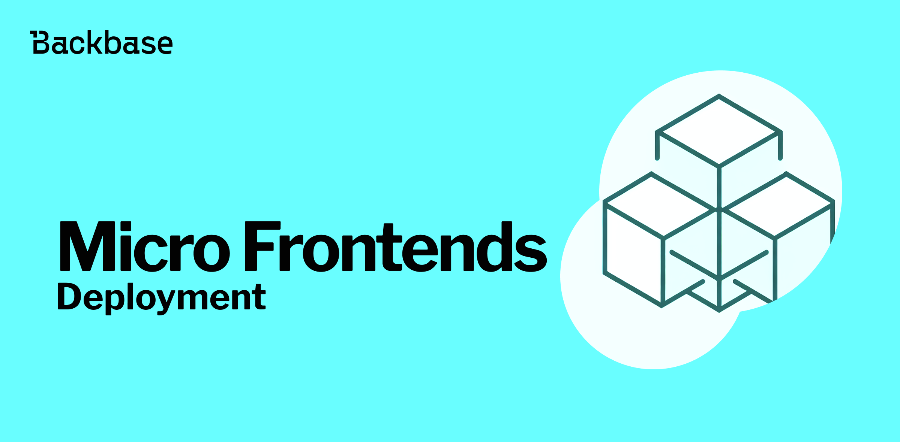

# Deployment strategy for Micro Frontends

The ultimate guide for deploying Micro Frontends with the Backbase web-base Docker image.



Authors: Pablo Villoslada Puigcerber
Date: unpublished
Category: frontend

tags: angular,docker,frontend,micro-frontends,module-federation,web

---

## Introduction

You need to keep two things in mind when deploying Micro Frontends: first of all, you have to coordinate the deployment of two or more applications; and second, you must tell your shell app where to find the remotes. 

Other than that, there are no big differences with any other deployment.

## Where are the remotes?

In [routing between the shell and the remote](2024/05/15/maintaining-legacy-code-with-micro-frontends#routing-between-the-shell-and-the-remote) you can find how to configure the routing but now, instead of using a static `remoteEntry`, you have to make it dynamic to cater for different environments.

To make it dynamic, you need to add a new property to your environment files. You can keep the URL hardcoded for your local config.

```typescript
export const environment: Environment = {
  ...,
  mfeUrl: 'http://localhost:4207/remoteEntry.js',
};
```

And make use of an environment variable in your production config.

```typescript
export const environment: Environment = {
  ...,
  mfeUrl: '${MFE_URL}remoteEntry.js',
};
```

Then you just need to set the new `mfeUrl` property in your routing configuration.

```typescript
import { environment } from '../environments/environment';

const remoteWrapperOptions = {
  elementName: 'remote-element',
  exposedModule: './web-components',
  remoteEntry: environment.mfeUrl,
  remoteName: 'remoteApp',
} as WebComponentWrapperOptions;
```

## Configure Docker

Configuring Docker it's going to entirely depend on your CI/CD set-up as you might want to build the app outside of Docker as part of your actions or pipelines.

For this example, with the goal of deploying the app locally, you can have an optimized multi-stage build with two stages: one for building the app, and another one to copy the output into the [web-base](https://backbase.io/developers/documentation/web-devkit/reference/web-base/) that runs the NGINX server.

Create a Dockerfile for your shell.
```shell
FROM node:16 AS builder
# Create app directory
WORKDIR /usr/src/app
# Install app dependencies
COPY package*.json ./
RUN --mount=type=secret,id=npmrc,target=/root/.npmrc npm install
# Bundle app source
COPY . .
RUN NODE_OPTIONS=--max-old-space-size=4096 npm run build

FROM repo.backbase.com/backbase-docker-releases/web-base:2.1.1
# Copy the build output
COPY --from=builder /usr/src/app/dist/shell /statics
```

And another one for the remote.
```shell
FROM node:18 AS builder
# Create app directory
WORKDIR /usr/src/app
# Install app dependencies
COPY package*.json ./
RUN --mount=type=secret,id=npmrc,target=/root/.npmrc npm install
# Bundle app source
COPY . .
RUN NODE_OPTIONS=--max-old-space-size=4096 npm run build

FROM repo.backbase.com/backbase-docker-releases/web-base:2.1.1
# Copy the build output
COPY --from=builder /usr/src/app/dist/remote-app /statics
```

## Local deployment

### Custom CSP configuration

Within the Docker container, the JavaScript of the remote app is going to load from a different port and that's not allowed by the default CSP configuration.

To overcome this problem, create a new file named `20-csp.conf` with the following content:

```shell
add_header Content-Security-Policy-Report-Only "default-src 'none'; script-src 'self' blob: ${MFE_URL}; media-src 'self'; connect-src 'self' ${API_ROOT::url_origin} ${AUTH_URL::url_origin}; img-src 'self'; style-src 'self' 'unsafe-inline' ; base-uri 'self'; object-src 'none'; font-src 'self'" always;
```

And add this line at the end of your shell's Dockerfile:
```shell
COPY 20-csp.conf /nginx-config/server/index/20-csp.conf
```

It overrides the default CSP configuration allowing the URL defined in the `MFE_URL` environment variable.  

### NGINX reverse proxy

Serving the Angular app locally you can configure the [Webpack proxy](https://v17.angular.io/guide/build#proxying-to-a-backend-server) to divert the `/api` calls to an actual backend server. But how can you do the same when deploying the app with Docker? Setting the [NGINX reverse proxy](https://docs.nginx.com/nginx/admin-guide/web-server/reverse-proxy/) prevents the CORS issues of having frontend and backend on different domains.

Create a new `15-proxy.conf` file:
```bash
location ^~ /api/ {
  proxy_set_header ${API_KEY} ${API_VALUE};
  proxy_pass ${API_URL};
}
```

And add an extra line to your Dockerfile:
```bash
COPY 15-proxy.conf /nginx-config/server/15-proxy.conf
```

Repeat this step for the remote app and keep in mind that depending on your backend server configuration you might need extra headers.

### Docker Compose

Although you could run the `docker` command individually for each image, [Compose](https://docs.docker.com/compose/) is going to help you streamline the process and also set all the environment variables.

Create `compose.yaml` in the root of your project and adjust accordingly, as this config works with the [API Sandbox](https://backbase.io/developers/documentation/api-sandbox/).
```bash
services:
  shell:
    build:
      context: ./shell
      secrets:
        - npmrc
    ports:
      - target: 8080
        published: 8080
    environment:
      API_KEY: X-Sdbxaz-Api-Key
      API_ROOT: /api/
      API_URL: https://app.bus.sdbxaz.azure.backbaseservices.com/api/
      API_VALUE: ''
      AUTH_CLIENT_ID: bb-web-client
      AUTH_REALM: customer
      AUTH_SCOPE: openid
      AUTH_URL: https://identity.bus.sdbxaz.azure.backbaseservices.com/auth/
      BASE_HREF: /
      HOSTNAME: localhost
      MFE_URL: http://localhost:4207/
      PORT: 8080
  remoteApp:
    build:
      context: ./remote-app
      secrets:
        - npmrc
    ports:
      - target: 4207
        published: 4207
    environment:
      API_KEY: X-Sdbxaz-Api-Key
      API_ROOT: /api/
      API_URL: https://app.bus.sdbxaz.azure.backbaseservices.com/api/
      API_VALUE: ''
      AUTH_CLIENT_ID: bb-web-client
      AUTH_REALM: customer
      AUTH_SCOPE: openid
      AUTH_URL: https://identity.bus.sdbxaz.azure.backbaseservices.com/auth/
      BASE_HREF: /
      HOSTNAME: localhost
      PORT: 4207

secrets:
  npmrc:
    file: ~/.npmrc
```

Now run `docker compose up` to build both images and if everything goes all right, you should be able to open http://localhost:8080/ in your browser and see real data.

## Conclusion

You might want to deploy each separately, or you may even have different teams working in each app, but as long as you tell the shell where the remotes are, deploying Micro Frontends is no different to deploying your regular Angular app.
