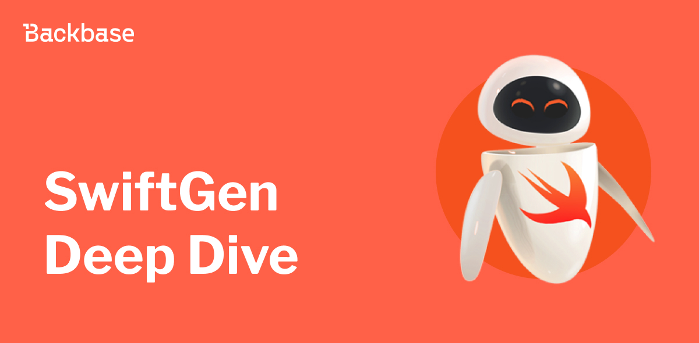
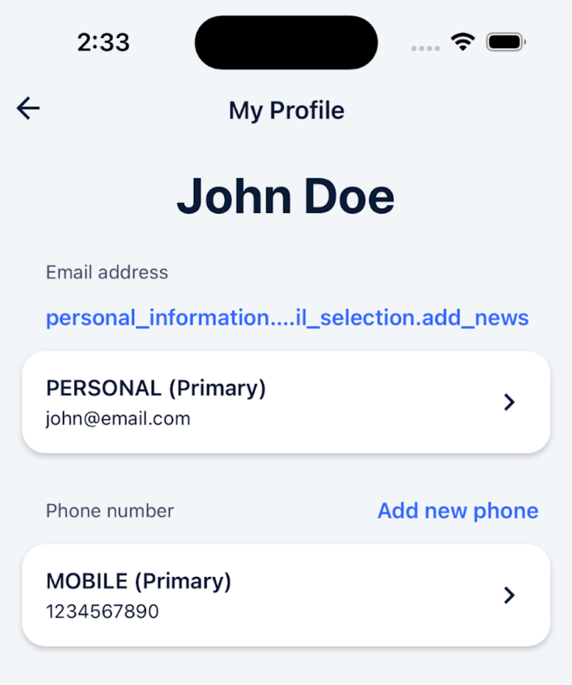
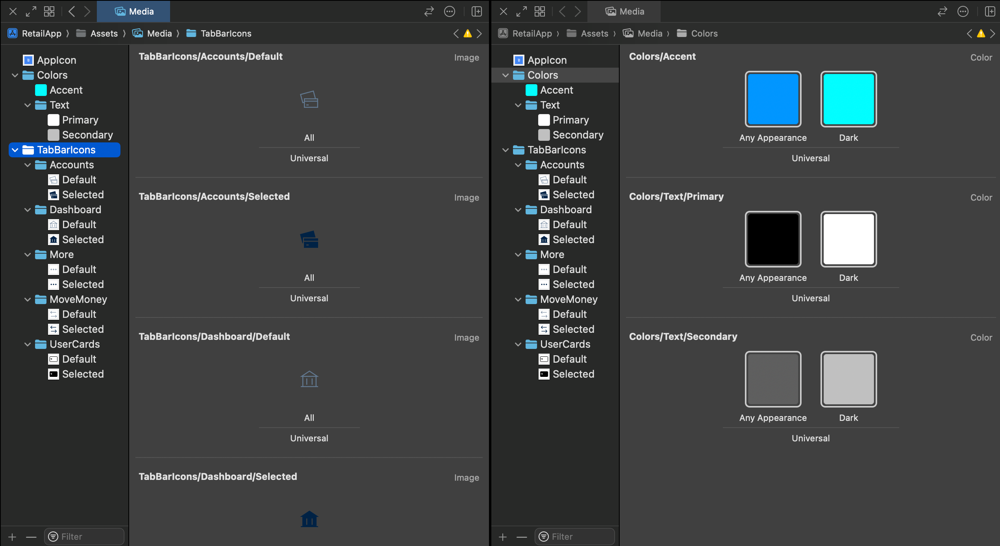
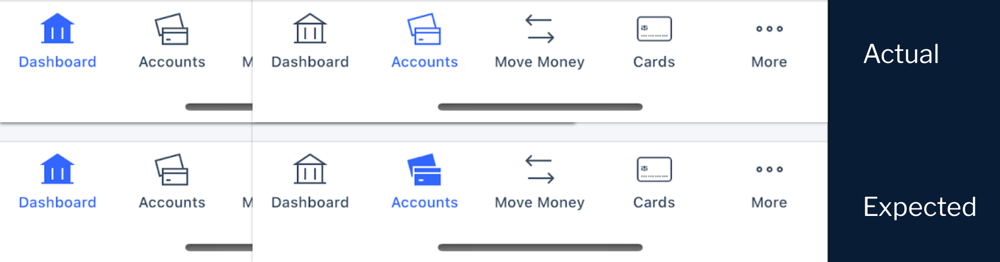
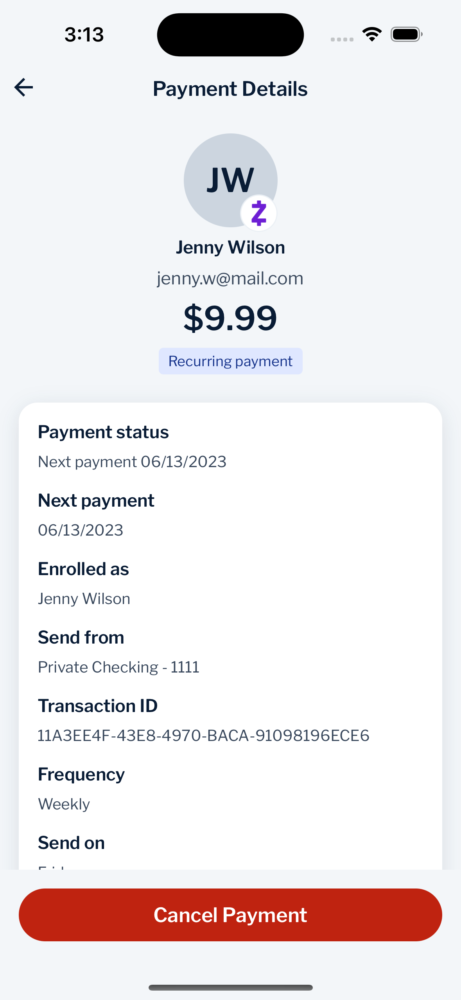
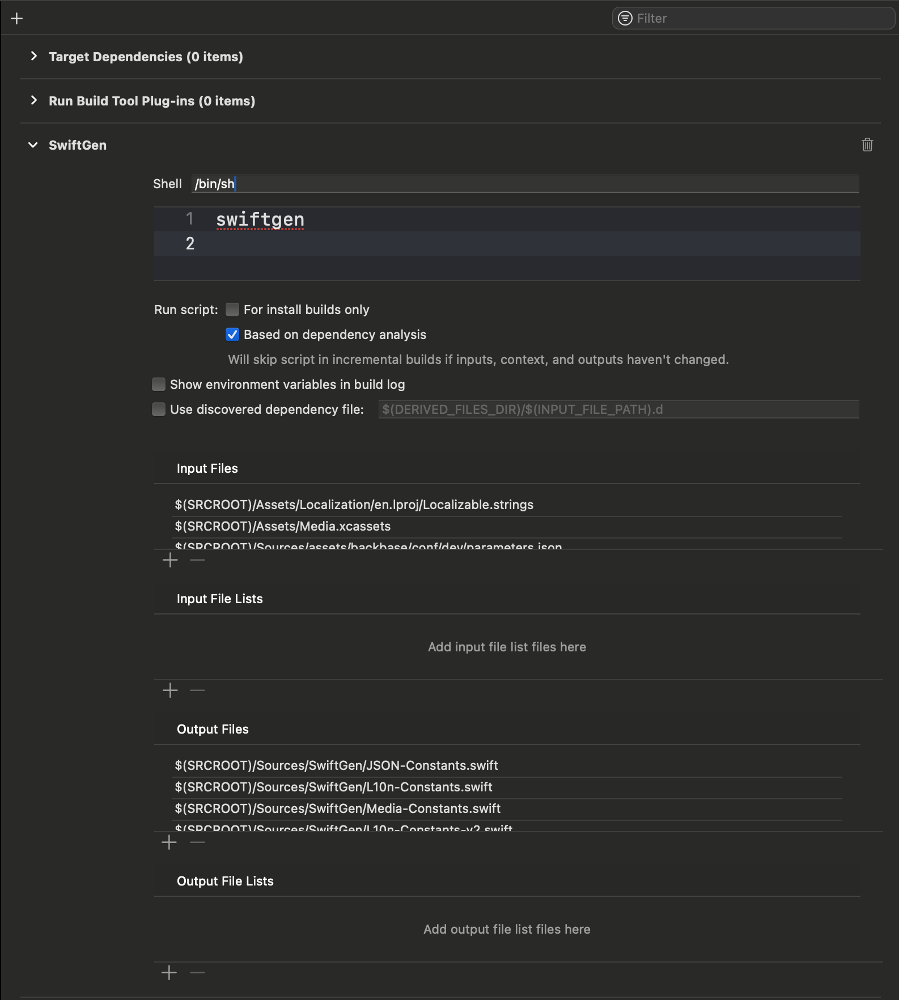
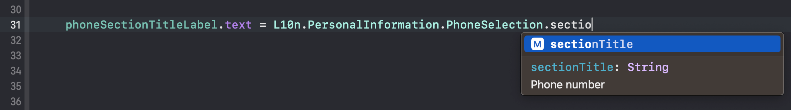
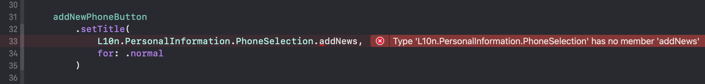
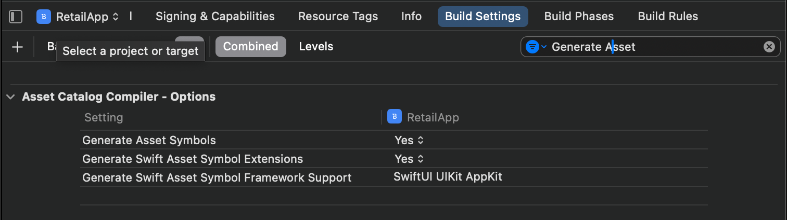

# Exploring code generation with SwiftGen

Exploring ways how we can utilize code generation to improve working with project resources using SwiftGen.



Authors: Daniel Sumara
Date: unpublished
Category: mobile

tags: iOS,SwiftGen,Code generation,tooling

---

Most of the apps are using many types of resources to enrich user experience. It may be something that is user-facing like images, animations, videos, fonts, or something more low-level like strings or configuration in any form (JSON, Plist, YAML).
While our app grows we tend to add new resources, amend existing ones, or even remove some which are not needed anymore.
Due to resources nature - they are loaded in runtime and referenced by string literals - it's easy to go out-of-sync between what we have bundled into our app and what we are trying to reference in our code.
Let's check how we can improve developers experience by leveraging code generation to make type-safe constants (as Swift code) for our project resources, but first, let's take a closer look at issues we may face during development related to using resources.

## Issues related with using resources in our apps

Let's take a look at the most used resources we are using while developing our apps and focus on issues we may face related to run-time nature of them.

### Strings

For apps that support multiple languages, we used to use the [NSLocalizedString](https://developer.apple.com/documentation/foundation/1418095-nslocalizedstring) macro.

Let's try to make our *My Profile* screen localizable.

To be able to use the above macro, we need at least one LocalizableStrings file bundled with our app filled with key-value pairs like:

```
// Localizable.strings
// ... 
/* Personal Information text overrides */
"personal_information.screen_title" = "My Profile";
"personal_information.email_selection.section_title" = "Email address";
"personal_information.email_selection.add_new" = "Add new email";
"personal_information.phone_selection.section_title" = "Phone number";
"personal_information.phone_selection.add_new" = "Add new phone";
// ...
```

Later in the UI Layer code, we need to reference copy by providing a string key as an NSLocalizedString argument.
Our code could look like this:

```swift
// UserProfileViewController.swift

func setupStaticCopy() {
    title = NSLocalizedString("personal_information.screen_title")
    emailSectionTitleLabel.text = NSLocalizedString("personal_information.email_selection.section_title", comment: "")
    addNewEmailButton.setTitle(NSLocalizedString("personal_information.email_selection.add_news", comment: ""), for: .normal)
    phoneSectionTitleLabel.text = NSLocalizedString("personal_information.phone_selection.section_title", comment: "")
    addNewPhoneButton.setTitle(NSLocalizedString("personal_information.phone_selection.add_new", comment: ""), for: .normal)
}
```

The outcome when we run the app will be:


As you noted, instead of the expected: *"Add new email"* text we get a localizable key instead.

It's due to a silly typo made while "retyping" the key for localized macro. Instead of add_new suffix, we have `add_news`. Above typo is quite easy to notice in runtime as it appear on main screen without any conditions or branching logic for text to display.

> **Note:**
> 
> If we consider more complex scenarios where label text is calculated based on some configuration or data (including edge cases) it may be tricky to notice issues in runtime.
>
> It is also hard to track changes inside the `Localizable.strings` file itself. If we remove or amend some lines (including values placeholders), we may end up out-of-sync between a localizable table and our code. It is crucial to make sure we are not using any removed key literals in our codebase to avoid issues like on above screenshot.
>

### Images and colors

It's hard to imagine an app that doesn't use any media like images, videos, or custom colors to make the app unique.

Let's consider the scenario where we would like to apply some icons for the app *TabBar* with the assumption that selected items display highlighted and filled icon variants.

To be able to reference media in an app we need to put them inside the `xcmedia` (Asset Catalog) directory.



As we reference assets like `UIImage` or `UIColor` via string literals, code that uses the above resources could look like this:

```swift
// MainTabBarViewController.swift

func setupMedia() {
    dashboardViewController.tabBarItem.image = UIImage(named: "TabBarIcons/Dashboard/Default")
    dashboardViewController.tabBarItem.selectedImage = UIImage(named: "TabBarIcons/Dashboard/Selected")
    accountsViewController.tabBarItem.image = UIImage(named: "TabBarIcons/Accounts/Default")
    accountsViewController.tabBarItem.selectedImage = UIImage(named: "TabBarIcons/Account/Selected")
    moveMoneyViewController.tabBarItem.image = UIImage(named: "TabBarIcons/MoveMoney/Default")
    moveMoneyViewController.tabBarItem.selectedImage = UIImage(named: "TabBarIcons/MoveMoney/Selected")
    // ...
}
```



When we run the app, at first glance all is good, but when we switch the tab to *Accounts* we will notice that our icon is highlighted but hasn't changed appearance to filled. The above issue appeared as the resource name used to instantiate the selected image was mistyped as `TabBarIcons/Account/Selected` instead of `TabBarIcons/Accounts/Selected` (there is a missing `s` in the middle path component).

To spot the above issue, we need to perform some actions - select an element on UI.

> **Note:**
>
> While we are using string literals to initialize objects corresponding to each resource (`UIImage`, `UIColor`, ...) we may face the same issues as for *Localized Strings*.
>
> Our code may easily run out of sync with *Media Catalog* while our codebase grows.
>

### JSON files

Some apps use resources like JSON, YAML, or Plist files to provide runtime configuration capabilities. Such files can be used to supply *Remote Configuration* default/fallback parameters.

> **Info:**
>
> Even though there are multiple *Remote Config* services and SDKs, for most of them there is a common strategy to supply default configuration while SDK initialization to fallback to these values in case of missing params defined on the service level or due to fetching issues.
>
> The SDK initialization process looks more/less like:
> - Initialise SDK.
> - Provide default/fallback parameter (either via file path, or dictionary).
> - Activate SDK - fetching parameters from service to override in-app params.

Let's consider the scenario where we would like to drive the visibility of the *Cancel Payment* button on the payment details screen. A few assumptions about our *Remote Config* integration:

- Fallback values are defined in the JSON file.
- *Remote Config* SDK is initialized on the app lever.
- SDK is active and overrides are fetched from *the Remote Config* Service.
  - `paymentDetailsCancelEnabled` is set to true

Our code may look like:

```json
{ 
    "feedbackEnabled": true,
    "feedbackSurveyID": "Ab35fsko",
    "paymentDetailsCancelEnabled": false
}
```
```swift 
// DefaultPaymentDetailsViewModel.swift 

final class DefaultPaymentDetailsViewModel: PaymentDetailsViewModel {
    // MARK: - Properties
    private let remoteConfig: RemoteConfig
    private(set) lazy var cancelPaymentVisible: Bool = makeCancelPaymentVisible()
    // ..
    // MARK: - Methods
    private func makeCancelPaymentVisible() -> Bool {
        remoteConfig.getBool(for: "paymentDetailsCancelEnalbed") ?? true
    }
}
```



When we run the app and navigate to *Payment Details* below screen will be visible.

At first glance all is good and the button is visible as `paymentDetailsCancelEnabled` was set to `true` in the remote config service, but once we toggle that value or remove it in the *Remote Config Service App*, the outcome doesn't change.

The expected result should be a screen without *the Cancel Payment* button as `paymentDetailsCancelEnabled` is set to `false` in app fallback values.

The bug is caused by an invalid key passed to the remote config `getBool(for:)` method. Enabled is mistyped and as a result we are getting `nil` from the mentioned method. As we fallback to `true` in our code, button is always visible.

This kind of bug requires much more effort to identify due to integration with third party service.

> **Note:**
>
> The above code exposes one more issue related to data inconsistency. The configuration default value for `paymentDetailsCancelEnabled` is set to `false`, but in the app code in case of missing value, we fallback to `true` (via `?? true` syntax).
>

### Wrap up

While we are working with resources we can identify some common issues:

- It's easy to make a typo providing a resource name.
- Is's possible to reference non-existing resources.
- We can verify our implementation in runtime.

## Code generation for the rescue

### Let's meet [**SwiftGen**](https://github.com/SwiftGen/SwiftGen)


**SwiftGen** is a tool to automatically generates Swift code for resources of your projects (like images, localized strings, etc) to make them type-safe to use.

To list some benefits of using SwiftGen:

- Avoid any risk of typos when using a String.
- Free auto-completion.
- Avoid the risk of using a non-existing asset name.
- All this will be ensured by the compiler and thus avoid the risk of crashing at runtime.

Also, it's fully customizable thanks to **Stencil** templates, so even if it comes with predefined templates, you can make your own to generate whatever code fits your needs and your guidelines.

📜 Parsers are **SwiftGen** "engines" which provides data for templates. 

📜 Templates are **Stencil** files containing "definitions" for code generators.

Available parsers:
 - Assets Catalogs
 - Colors
 - Core Data
 - Files
 - Fonts
 - Interface Builder files
 - JSON and YAML files
 - Plists
 - Localizable strings

**SwiftGen** provides multiple ready-to-use templates for each parser witch will fit most needs.

Also, it supports custom templates which we may create to match our exact needs and requirements.

### Project setup

To integrate **SwiftGen** with the project we need to perform some steps.

- [Install **SwiftGen** on local](https://github.com/SwiftGen/SwiftGen?tab=readme-ov-file#installation)
- Create **SwiftGen** config
   - Update the config file to include parsers required for the project
   - Lint configuration

Example config file may look like:

```yaml 
// swiftgen.yaml

input_dir: Assets/
output_dir: Sources/SwiftGen/
strings:
  - inputs: Localization/en.lproj/Localizable.strings
    outputs:
      - templateName: structured-swift5
        output: L10n-Constants.swift
xcassets:
  - inputs: Media.xcassets
    outputs:
      - templateName: swift5
        output: Media-Constants.swift
        params:
          enumName: Media
json:
  - inputs: parameters.json
    outputs:
      templateName: runtime-swift5
      output: JSON-Constants.swift

```

- Run **SwiftGen** from the terminal to make sure the configuration is valid and create generated files
- Add generated files to the project
- Create new **Xcode** *Run Script Build Phase*
  - Execute **SwiftGen** 
  - Add *Input Files* (should match **SwiftGen** inputs)
  - Add *Output Files* (should match **SwiftGen** outputs)



The list of Input Files and Output Files must match the files defined in **SwiftGen** YAML configuration.

This way Xcode build system can identify if any of the defined files have changed and execute code generation only after changes.

- Validate integration by building the project (you may change inputs to double-check that generated files will be updated)
- Use generated constants instead of string literals

## Generated constants

### Strings and **SwiftGen**

Let's take a look at the code generated by the out-of-the-box `structured-swift5` template:

```swift 
// swiftlint:disable all
// Generated using SwiftGen - https://github.com/SwiftGen/SwiftGen
import Foundation
// MARK: - Strings
internal enum L10n {
  internal enum PersonalInformation {
    internal static let screenTitle = L10n.tr("Localizable", "personal_information.screen_title", fallback: "My Profile")
    internal enum EmailSelection {
      /// Add new email
      internal static let addNew = L10n.tr("Localizable", "personal_information.email_selection.add_new", fallback: "Add new email")
      /// Email address
      internal static let email = L10n.tr("Localizable", "personal_information.email_selection.section_title", fallback: "Email address")
    }
    internal enum PhoneSelection {
      /// Add new phone
      internal static let addNew = L10n.tr("Localizable", "personal_information.phone_selection.add_new", fallback: "Add new phone")
      /// Phone number
      internal static let sectionTitle = L10n.tr("Localizable", "personal_information.phone_selection.section_title", fallback: "Phone number")
    }
  }
  // ...
}
// MARK: - Implementation Details
extension L10n {
  private static func tr(_ table: String, _ key: String, _ args: CVarArg..., fallback value: String) -> String {
    let format = BundleToken.bundle.localizedString(forKey: key, value: value, table: table)
    return String(format: format, locale: Locale.current, arguments: args)
  }
}
private final class BundleToken {
  static let bundle: Bundle = {
    #if SWIFT_PACKAGE
    return Bundle.module
    #else
    return Bundle(for: BundleToken.self)
    #endif
  }()
}

```

Localizations may be represented by static constants (let properties) or static functions (if value contains attributes placeholders such as `%@`, `%d`, `%f`) populated with `tr` method where:

- table represents `.strings` or `.stringsdict` file name if we supply the parser with multiple inputs.
- key reference to the given key for translation.
- args are used to supply `String(format:locale:arguments:)` function with data passed from the client.

> **Note:**
>
> Even though we can use any of [String Format Specifiers](https://developer.apple.com/library/archive/documentation/Cocoa/Conceptual/Strings/Articles/formatSpecifiers.html) in `.strings` files it is good practice to properly format attributes in the app itself and pass the result as a String value.
>
> This way app will be responsible for proper formatting without "employing" the Operating System to format inputs on the app's behalf.

As we are using a "structured" template for localization, constants will be structured into namespaces where `.` (dot) is considered as delimiter (we are able to override it via configuration).

Let's check how we can use generated constants for our previous scenario:

```diff
// UserProfileViewController.swift

func setupStaticCopy() {
-    title = NSLocalizedString("personal_information.screen_title", comment: "")
+    title = L10n.PersonalInformation.screenTitle
    
-    emailSectionTitleLabel.text = NSLocalizedString("personal_information.email_selection.section_title", comment: "")
+    emailSectionTitleLabel.text = L10n.PersonalInformtion.EmailSelection.sectionTitle
-    addNewEmailButton.setTitle(NSLocalizedString("personal_information.email_selection.add_new", comment: ""), for: .normal)
+    addNewEmailButton.setTitle(L10n.PersonalInformtion.EmailSelection.addNew, for: .normal)
-    phoneSectionTitleLabel.text = NSLocalizedString("personal_information.phone_selection.section_title", comment: "")
+    phoneSectionTitleLabel.text = L10n.PersonalInformtion.PhoneSelection.sectionTitle
-    addNewPhoneButton.setTitle(NSLocalizedString("personal_information.phone_selection.add_new", comment: ""), for: .normal)
+    addNewPhoneButton.setTitle(L10n.PersonalInformtion.PhoneSelection.addNew, for: .normal)
}
```

The updated code looks much better - besides getting rid of magic strings we gain benefits like:
 - Autocompletion with inline comments.

 - Compiler support, so we won't be able to use non-existing resources.


> **Note:**
>
> From a technical point of view, we are still using String literals, but they are backed by static constants generated by **SwiftGen** during project compilation.

### Media resources and SwiftGen

When we take a look at the file generated file for media resources, we will learn that it is very similar to what we get for localization.

```swift
// swiftlint:disable all
// Generated using SwiftGen - https://github.com/SwiftGen/SwiftGen
#if os(macOS)
  import AppKit
#elseif os(iOS)
  import UIKit
#elseif os(tvOS) || os(watchOS)
  import UIKit
#endif
#if canImport(SwiftUI)
  import SwiftUI
#endif
// MARK: - Asset Catalogs
internal enum Media {
  internal enum Colors {
    internal static let accent = ColorAsset(name: "Colors/Accent")
    internal enum Text {
      internal static let primary = ColorAsset(name: "Colors/Text/Primary")
      internal static let secondary = ColorAsset(name: "Colors/Text/Secondary")
    }
  }
  internal enum TabBarIcons {
    internal enum Accounts {
      internal static let `default` = ImageAsset(name: "TabBarIcons/Accounts/Default")
      internal static let selected = ImageAsset(name: "TabBarIcons/Accounts/Selected")
    }
    internal enum Dashboard {
      internal static let `default` = ImageAsset(name: "TabBarIcons/Dashboard/Default")
      internal static let selected = ImageAsset(name: "TabBarIcons/Dashboard/Selected")
    }
    internal enum More {
      internal static let `default` = ImageAsset(name: "TabBarIcons/More/Default")
      internal static let selected = ImageAsset(name: "TabBarIcons/More/Selected")
    }
    internal enum MoveMoney {
      internal static let `default` = ImageAsset(name: "TabBarIcons/MoveMoney/Default")
      internal static let selected = ImageAsset(name: "TabBarIcons/MoveMoney/Selected")
    }
    internal enum UserCards {
      internal static let `default` = ImageAsset(name: "TabBarIcons/UserCards/Default")
      internal static let selected = ImageAsset(name: "TabBarIcons/UserCards/Selected")
    }
  }
}
// MARK: - Implementation Details
// ...
```

> **Info:**
>
> As **SwiftGen** supports multiple platforms, under the Implementation Details section there is much more boiler plate code to abstract implementation details.

The content of the Media enum is structured by default based on the directory structure in the Asset Catalog itself.

Let's replace our previous implementation with generated constants:

```diff
// MainTabBarViewController.swift

func setupMedia() {
-    dashboardViewController.tabBarItem.image = UIImage(named: "TabBarIcons/Dashboard/Default")
+    dashboardViewController.tabBarItem.image = Media.TabBarIcons.Dashboard.default.image
-    dashboardViewController.tabBarItem.selectedImage = UIImage(named: "TabBarIcons/Dashboard/Selected")
+    dashboardViewController.tabBarItem.selectedImage = Media.TabBarIcons.Dashboard.selected.image
    // ...
}
```

As generated constants for Media resources (Asset Catalogue) use almost the same semantics as constants generated for localization, we are getting the same benefits:
- Autocompletion
- Compiler support (we won't be able to use non-existing resources, and the compiler will make sure we are using expected types)

> **Info:**
>
> Due to *SwiftUI* support, we need suffix constants to reference the expected type.
>
> For:
> - Images
>   - `image` - produce `UIImage` type
>   - `swiftUIImage` - produce `SwiftUI.Image` structure
> - Color
>   - `color` - produce `UIColor` type
>   - `swiftUIColor` - produce `SwiftUI.Color` structure

#### Xcode 15 support

With the Xcode 15 release, new options were introduced for *Asset Catalog Compiler - Options*:



Setting `Generate Asset Symbols` and `Generate Swift Asset Symbol Extensions` will produce code very similar to one we have from **SwiftGen**, but without employing third party tool, and we'll have access to generated extensions for shorthand syntax.

The code generated by Xcode looks like this:

```swift
// .. Imports
// MARK: - Color Symbols -
@available(iOS 11.0, macOS 10.13, tvOS 11.0, *)
extension ColorResource {
    /// The "Colors" asset catalog resource namespace.
    enum Colors {
        /// The "Colors/Accent" asset catalog color resource.
        static let accent = ColorResource(name: "Colors/Accent", bundle: resourceBundle)
        /// The "Colors/Text" asset catalog resource namespace.
        enum Text {
            /// The "Colors/Text/Primary" asset catalog color resource.
            static let primary = ColorResource(name: "Colors/Text/Primary", bundle: resourceBundle)
            /// The "Colors/Text/Secondary" asset catalog color resource.
            static let secondary = ColorResource(name: "Colors/Text/Secondary", bundle: resourceBundle)
        }
    }
}
// MARK: - Image Symbols -
@available(iOS 11.0, macOS 10.7, tvOS 11.0, *)
extension ImageResource {
    /// The "TabBarIcons" asset catalog resource namespace.
    enum TabBarIcons {
        /// The "TabBarIcons/Dashboard" asset catalog resource namespace.
        enum Dashboard {
            /// The "TabBarIcons/Dashboard/Default" asset catalog image resource.
            static let `default` = ImageResource(name: "TabBarIcons/Dashboard/Default", bundle: resourceBundle)
            /// The "TabBarIcons/Dashboard/Selected" asset catalog image resource.
            static let selected = ImageResource(name: "TabBarIcons/Dashboard/Selected", bundle: resourceBundle)
        }
        /// The "TabBarIcons/Accounts" asset catalog resource namespace.
        enum Accounts {
            /// The "TabBarIcons/Accounts/Default" asset catalog image resource.
            static let `default` = ImageResource(name: "TabBarIcons/Accounts/Default", bundle: resourceBundle)
            /// The "TabBarIcons/Accounts/Selected" asset catalog image resource.
            static let selected = ImageResource(name: "TabBarIcons/Accounts/Selected", bundle: resourceBundle)
        }
    }
}
// MARK: - Color Symbol Extensions -
#if canImport(UIKit)
@available(iOS 11.0, tvOS 11.0, *)
@available(watchOS, unavailable)
extension UIKit.UIColor {
    /// The "Colors" asset catalog resource namespace.
    enum Colors {
        /// The "Colors/Accent" asset catalog color.
        static var accent: UIKit.UIColor { .init(resource: .Colors.accent) }
        /// The "Colors/Text" asset catalog resource namespace.
        enum Text {
            /// The "Colors/Text/Primary" asset catalog color.
            static var primary: UIKit.UIColor { .init(resource: .Colors.Text.primary) }
            /// The "Colors/Text/Secondary" asset catalog color.
            static var secondary: UIKit.UIColor { .init(resource: .Colors.Text.secondary) }
        }
    }
}
#endif
#if canImport(UIKit)
@available(iOS 11.0, tvOS 11.0, *)
@available(watchOS, unavailable)
extension UIKit.UIImage {
    /// The "TabBarIcons" asset catalog resource namespace.
    enum TabBarIcons {
        /// The "TabBarIcons/Dashboard" asset catalog resource namespace.
        enum Dashboard {
            /// The "TabBarIcons/Dashboard/Default" asset catalog image.
            static var `default`: UIKit.UIImage { .init(resource: .TabBarIcons.Dashboard.`default`) }
            /// The "TabBarIcons/Dashboard/Selected" asset catalog image.
            static var selected: UIKit.UIImage { .init(resource: .TabBarIcons.Dashboard.selected) }
        }
        // ...
        }
    }
}
#endif
// ...  
```

Using the above APIs we may use:

- New initializer variants for resource types like:
  - `UIImage(resource: ImageResource)`
  - `Image(resource: ImageResource)`
  - `UIColor(resource: ColorResource)`
  - `Color(resource: ColorResource)`
- Extension methods for any of the types mentioned above.

We can simplify the above code even more:

```diff
// MainTabBarViewController.swift

func setupMedia() {
-    dashboardViewController.tabBarItem.image = Media.TabBarIcons.Dashboard.default.image
+    dashboardViewController.tabBarItem.image = .TabBarIcons.Dashboard.default
-    dashboardViewController.tabBarItem.selectedImage = Media..TabBarIcons.Dashboard.selected.image
+    dashboardViewController.tabBarItem.selectedImage = .TabBarIcons.Dashboard.selected
    // ...
}
```

> **Note:**
>
> As Xcode supports code generation for Asset Catalog there is no point in using any external tools unless you have a very specific use case with custom code generation rules (using a dedicated **Stencil** template to achieve the expected outcome).

### JSON files and SwiftGen

If we take a look at the content generated by any out-of-the-box templates for JSON parser we learn that it won't fit our needs to support *Remote Config*.

```swift
internal enum JSONFiles {
    internal static let feedbackEnabled: Bool = true
    internal static let feedbackSurveyID: String = "Ab35fsko"
    internal static let paymentDetailsCancelEnabled: Bool = false
}
```

To be able to integrate it with our Remote Config service we need to create our own **Stencil** template crafted specifically for our use case.

What we would like to achieve is to have type-safe APIs backed by generated constants with fallback value support so we don't need to handle nil-checks.

From the client's perspective, *Remote Config* SDK usage could look like this:

```swift
// DefaultPaymentDetailsViewModel.swift 
private func makeCancelPaymentVisible() -> Bool {
    remoteConfig.value(for: \.paymentDetailsCancelEnalbed)
}
```

To be able to achieve such syntax we need to introduce some helping content which will:
- Describe parameter:
  - key
  - type
  - fallback value
- Encapsulate constants created based on JSON content.
- Extend Remote Config APIs with value(for:) method.

The next step would be to create a custom template where we will be able to define the code we need to be generated.

> **Info:**
>
> As pointed out in **SwiftGen** documentation, the easiest way to create our own template is to copy one of the existing templates and amend it cordially to our needs.

For ones interested:

```stencil
// tokens-from-json.stencil

// swiftlint:disable all
// Generated using SwiftGen — https://github.com/SwiftGen/SwiftGen

import Foundation
// MARK: - JSON Files

  


  
  
  static let items: {{rootType}} = 
  
  
  
  
  
  static let value = ConfigurationParameter<{{rootType}}>(key: {{key}}, value: {{}}) 
  


  
    []
  
    [String: Any]
  
    Any?
  
    {{metadata.type}}
  


  {{key|swiftIdentifier:"pretty"|lowerFirstWord|escapeReservedKeywords}}
  
  // Fallback value: 
  private(set) lazy var {{propertyName}} = ConfigurationParameter<{{propertyType}}>(key: "{{key}}", value: )


  
    "{{ value }}"
  
    nil
  
    [
      
      {{ ", " if not forloop.last }}
    ]
  
    [
      "{{key}}": 
      {{ ", " if not forloop.last }}
    
      :
    ]
  
    truefalse
  
    {{ value }}
  

struct ConfigurationParameter<ValueType> {
    // MARK: - Properties
    let key: String
    let value: ValueType
}
final class {{param.enumName|default:"ConfigurationParameters"}} {
  static let instance = ConfigurationParameters()
  
  
  enum {{file.name|swiftIdentifier:"pretty"|escapeReservedKeywords}} {
    
  }
  
  
  
  
}
#if canImport(BackbaseRemoteConfig) 
import BackbaseRemoteConfig
extension RemoteConfig {
    func value<ValueType>(for parameter: KeyPath<ConfigurationParameters, ConfigurationParameter<ValueType>>) -> ValueType {
        let parameter = ConfigurationParameters.instance[keyPath: parameter]
        return value(for: parameter.key) ?? parameter.value
    }
    private func value<ValueType>(for key: String) -> ValueType? {
        switch ValueType.self {
        case is String.Type: return getString(name: key) as? ValueType
        case is Bool.Type: return getBool(name: key) as? ValueType
        case is Int.Type: return getInt(name: key) as? ValueType
        case is Double.Type: return getDouble(name: key) as? ValueType
        default:
            assertionFailure("No value for key: \"\(key)\" in remote config!")
            return nil
        }
    }
}
#endif
#if canImport(FirebaseRemoteConfig) 
import FirebaseRemoteConfig
extension RemoteConfig {
    func value<ValueType>(for parameter: KeyPath<ConfigurationParameters, ConfigurationParameter<ValueType>>) -> ValueType {
        let parameter = ConfigurationParameters.instance[keyPath: parameter]
        return value(for: parameter.key) ?? parameter.value
    }
    private func value<ValueType>(for key: String) -> ValueType? {
        switch ValueType.self {
        case is String.Type: return configValue(forKey: key)?.stringValue as? ValueType
        case is Bool.Type: return configValue(forKey: key)?.boolValue as? ValueType
        case is Int.Type: return configValue(forKey: key)?.intValue as? ValueType
        case is Double.Type: return configValue(forKey: key)?.numberValue as? ValueType
        default:
            assertionFailure("No value for key: \"\(key)\" in remote config!")
            return nil
        }
    }
}
#endif

// No files found

```

The above template will produce code like:

``` 
// swiftlint:disable all
// Generated using SwiftGen - https://github.com/SwiftGen/SwiftGen
import Foundation
struct ConfigurationParameter<ValueType> {
    // MARK: - Properties
    let key: String
    let value: ValueType
}
final class ConfigurationParameters {
    static let instance = ConfigurationParameters()
    // Fallback value: true
    private(set) lazy var feedbackEnabled = ConfigurationParameter<Bool>(key: "feedbackEnabled", value: true)
    // Fallback value: "Ab35fsko"
    private(set) lazy var feedbackSurveyID = ConfigurationParameter<String>(key: "feedbackSurveyID", value: "Ab35fsko")
    // Fallback value: false
    private(set) lazy var paymentDetailsCancelEnabled = ConfigurationParameter<Bool>(key: "paymentDetailsCancelEnabled", value: false)
}
#if canImport(BackbaseRemoteConfig) 
import BackbaseRemoteConfig
extension RemoteConfig {
    func value<ValueType>(for parameter: KeyPath<ConfigurationParameters, ConfigurationParameter<ValueType>>) -> ValueType {
        let parameter = ConfigurationParameters.instance[keyPath: parameter]
        return value(for: parameter.key) ?? parameter.value
    }
    private func value<ValueType>(for key: String) -> ValueType? {
        switch ValueType.self {
        case is String.Type: return getString(name: key) as? ValueType
        case is Bool.Type: return getBool(name: key) as? ValueType
        case is Int.Type: return getInt(name: key) as? ValueType
        case is Double.Type: return getDouble(name: key) as? ValueType
        default:
            assertionFailure("No value for key: \"\(key)\" in remote config!")
            return nil
        }
    }
}
#endif
#if canImport(FirebaseRemoteConfig) 
import FirebaseRemoteConfig
extension RemoteConfig {
    func value<ValueType>(for parameter: KeyPath<ConfigurationParameters, ConfigurationParameter<ValueType>>) -> ValueType {
        let parameter = ConfigurationParameters.instance[keyPath: parameter]
        return value(for: parameter.key) ?? parameter.value
    }
    private func value<ValueType>(for key: String) -> ValueType? {
        switch ValueType.self {
        case is String.Type: return configValue(forKey: key)?.stringValue as? ValueType
        case is Bool.Type: return configValue(forKey: key)?.boolValue as? ValueType
        case is Int.Type: return configValue(forKey: key)?.intValue as? ValueType
        case is Double.Type: return configValue(forKey: key)?.numberValue as? ValueType
        default:
            assertionFailure("No value for key: \"\(key)\" in remote config!")
            return nil
        }
    }
}
#endif
```

> **Note:**
>
> Using such an approach, we can leverage default parameters used by Remote Config SDK to the code level.
>
> We get type-safe constants backed by JSON configuration files.
>
> The compiler will ensure that we:
> - Aren't using keys that are not defined in a configuration file.
> - Don't reference values that are removed as part of the cleanup.
> - Won't assign a bool value to string property due to type check.
>
> Lastly, we eliminated the issue with different code fallback values (due to nil coalescing checks) across multiple places in the app as the fallback value will be supplied during compilation by **SwiftGen**.

## Wrap up

We touched only the surface of what we can achieve and how we can improve the developer experience by going through some basic use cases. Besides parsers which we use above there are several others that may be used for other purposes to improve code base and keep code in sync with resources.

To conclude: **SwiftGen** is a really powerful tool that together with **Stencil** and custom templates may resolve massive issues related to using resources bundled with our app.

Out-of-the-box templates fit most of the developer's needs, but if we need some specific/tailored approach to code generation we are able to create our own template.

Also, it is worth stressing that **SwiftGen** is not a single tool that generates code and it's not a silver bullet to solve all issues.

We should choose our tooling based on common sense and prefer tools that solve specific problems.

### Other tools worth mentioning:

- [https://github.com/krzysztofzablocki/Sourcery](https://github.com/krzysztofzablocki/Sourcery)
- [https://github.com/swagger-api/swagger-codegen](https://github.com/swagger-api/swagger-codegen)
- [https://nshipster.com/swift-gyb/](https://nshipster.com/swift-gyb/)
- [https://github.com/mac-cain13/R.swift](https://github.com/mac-cain13/R.swift)

> **Info:**
> 
> You are able to write any script in Swift itself 🙂 
