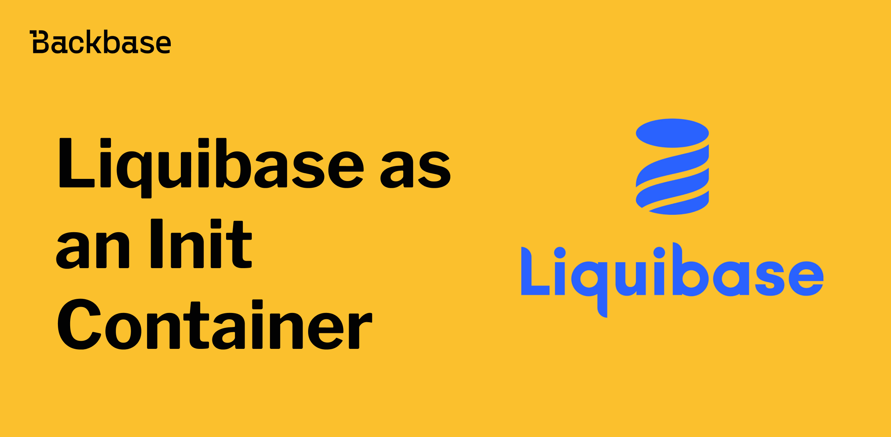
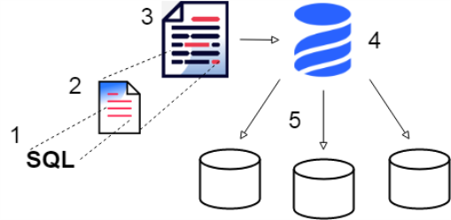
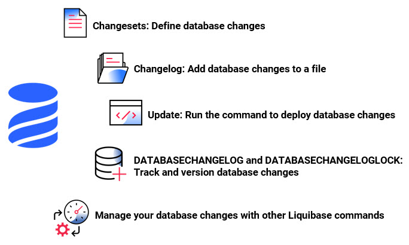

# Liquibase as an Init Container

Exploring Liquibase's integration as an init container, emphasizing database change locking and initialization container usage for streamlined schema management in containerized environments.



Authors: Furkan Aksin
Date: unpublished
Category: backend

tags: liquibase, backend, init container, container, kubernetes, docker, auxiliary, config, database, change

---

## **Understanding Init Containers**

[Init containers](https://kubernetes.io/docs/concepts/workloads/pods/init-containers/) in Kubernetes are specialized containers that run before the main application containers start. They handle initialization tasks, such as setting up configurations or fetching necessary data. This ensures that the main application containers only start once all dependencies are met.

---

## **Introduction to Liquibase**

[Liquibase](https://docs.liquibase.com/concepts/introduction-to-liquibase.html) serves as a pivotal tool in modern database management, offering developers a seamless solution for tracking and automating database schema changes. With its user-friendly interface and powerful features, Liquibase simplifies the complexities of database versioning and deployment, allowing teams to maintain consistency and reliability across their database environments. By providing a comprehensive platform for managing database changes, Liquibase empowers developers to focus on innovation and collaboration, rather than being overwhelmed by manual database maintenance tasks.



---

## **Why Liquibase as an Init Containers?**

While using Liquibase as an init container in Kubernetes deployments, teams gain the ability to efficiently handle database schema changes even before the main application container kicks off. This strategy brings several advantages: it guarantees that database updates are consistently and reliably applied across all instances of the application, no matter the environment. Additionally, incorporating Liquibase into an init container promotes a cleaner separation of tasks and boosts the modularity of the application's design. By doing so, we ensure that initializing the database doesn't slow down or interfere with the application's startup process, thus leading to a more reliable and manageable system. In essence, embracing Liquibase as an init container within Kubernetes offers a robust solution for managing database schemas, ultimately enhancing the scalability, reliability, and maintainability of our containerized applications.

---

## **Integrating Liquibase**

Liquibase, a powerful database schema management tool, can be seamlessly integrated into Kubernetes environments as an init container. By leveraging Liquibase's capabilities, teams can automate database schema changes and ensure consistency across deployments.

---


### Getting Started with Liquibase and Kubernetes

To begin, let's review the official Kubernetes documentation on init containers and Liquibase's guidelines for using Liquibase in Kubernetes environments. These resources provide valuable insights into setting up and configuring Liquibase as an init container.

> Preparation Steps:

- **Install Liquibase:** Set up Liquibase in your project and configure it to manage your database schema.
- **Define Change Sets:** Create XML or YAML change sets that specify the desired database schema changes.
- **Configure Liquibase Parameters:** Specify the necessary parameters for Liquibase, including database connection details and change set locations.
- **Ensure Kubernetes Access:** Ensure that the Kubernetes environment has access to the necessary database resources.
- **Creating the Init Container Definition:** In your Kubernetes YAML configuration, define an init container that will run Liquibase. Include the Liquibase image and provide the required parameters for connecting to the database and applying schema changes.



---

### Handling Dependencies and Timing

It's crucial to manage dependencies between init containers and other application containers. Ensure that Liquibase runs at the appropriate time during pod initialization to apply schema changes before the main application starts.


### Error Handling and Rollback Strategies

Implement error monitoring mechanisms during init container execution and devise rollback strategies in case of failed schema changes. Liquibase's built-in features for tracking changes make it easier to revert to previous states if needed.


### Testing and Deployment

Before deploying to production, thoroughly test the init container configuration in a staging environment. Validate that Liquibase successfully applies schema changes and that the main application containers start without issues.

---

## **Liquibase with Init Container**

In the dynamic landscape of Kubernetes deployments, efficient database schema management is imperative for ensuring the reliability and scalability of applications. One promising approach gaining traction is the utilization of Liquibase as an init container within Kubernetes environments. Let's explore how the integration of Liquibase with Kubernetes, complemented by the Auxiliary Config module, can streamline database schema management while ensuring robust containerization practices.


### Understanding Auxiliary Config

The Auxiliary Config module serves as a cornerstone in facilitating the configuration process during Docker image building. This dependency, facilitated by the `docker-image` profile in `service-sdk-starter-core`, is instrumental in configuring Docker images. Particularly, it caters to essential configurations required for various components, including RabbitMQ. One notable feature of the Auxiliary Config module is its provision of an `InitContainerApplication` for Liquibase initialization, which streamlines the setup process while ensuring multi-tenancy support.


### Init Container for Liquibase as Auxiliary Config

Integrating Liquibase into your Kubernetes environment involves leveraging the `InitContainerApplication` provided by the Auxiliary Config module. Below are sample configurations for incorporating Liquibase as an init container in Docker Compose and Kubernetes YAML:

> Docker Compose
```yaml
entrypoint: "java -cp /app/extras/*:/app/WEB-INF/classes:/app/WEB-INF/lib/* com.backbase.buildingblocks.auxiliaryconfig.InitContainerApplication"
```

> Kubernetes YAML
```yaml
spec:
  initContainers:
    - name: init-liquibase
      command: ['java']
      args: ['-cp', '/app/extras/*:/app/WEB-INF/classes:/app/WEB-INF/lib/*',
             'com.backbase.buildingblocks.auxiliaryconfig.InitContainerApplication']
```


Additionally, you can incorporate additional auto-configuration classes into the startup process using the `backbase.init.include` property. Exclusion of default configurations can be achieved through either `backbase.init.exclude` or `spring.autoconfigure.exclude` properties.

Furthermore, to ensure seamless database availability, the Auxiliary Config module sets the `spring.datasource.hikari.initialization-fail-timeout` property, allowing ample time for the database to become operational.

One critical aspect to consider when using Liquibase in Kubernetes environments is managing the database change lock. This ensures that only one instance of Liquibase is running at a time to prevent conflicts and data corruption. By leveraging Kubernetes primitives such as ConfigMaps or Secrets, you can implement a distributed lock mechanism to coordinate Liquibase executions across multiple pods, ensuring data integrity and consistency.


---

> Sample Code Snippets
```yaml
// Sample Liquibase changelog
databaseChangeLog:
  - changeSet:
      id: 1
      author: john
      changes:
        - createTable:
            tableName: example_table
            columns:
              - column:
                  name: id
                  type: int
                  autoIncrement: true
                  constraints:
                    primaryKey: true
              - column:
                  name: name
                  type: varchar(255)
```


```yaml
# Kubernetes YAML configuration with Liquibase init container
spec:
  initContainers:
    - name: init-liquibase
      image: liquibase/liquibase:latest
      command: ["liquibase"]
      args: ["--changeLogFile=db/changelog.xml", "--url=jdbc:mysql://mysql:3306/mydb", "--username=user", "--password=password", "update"]
```

---

## Benefits of Using Liquibase as an Init Container

- **Streamlined Database Management:** Liquibase simplifies database schema management within Kubernetes environments, ensuring consistency and reliability across deployments.
- **Automated Schema Changes:** By leveraging Liquibase as an init container, teams can automate the application of database schema changes, reducing manual intervention and minimizing errors.
- **Enhanced Scalability:** The use of Liquibase in Kubernetes init containers facilitates seamless scalability, allowing applications to adapt to changing demands efficiently.
- **Version Control and Auditing:** Liquibase enables version control and auditing of database schema changes, providing visibility into the evolution of the database over time.


## Drawbacks of Using Liquibase as an Init Container

- **Learning Curve:** Configuring Liquibase as an init container may require a learning curve, especially for teams unfamiliar with the tool or Kubernetes environments.
- **Performance Overhead:** In certain scenarios, running Liquibase as an init container may introduce performance overhead, particularly in environments with large databases or complex schema changes.

---

## Conclusion

By incorporating Liquibase with Kubernetes through the Auxiliary Config module, organizations can elevate their database schema management practices, fostering agility and reliability within their containerized deployments. This integration not only streamlines the initialization process but also fortifies the foundation for scalable and resilient Kubernetes applications.