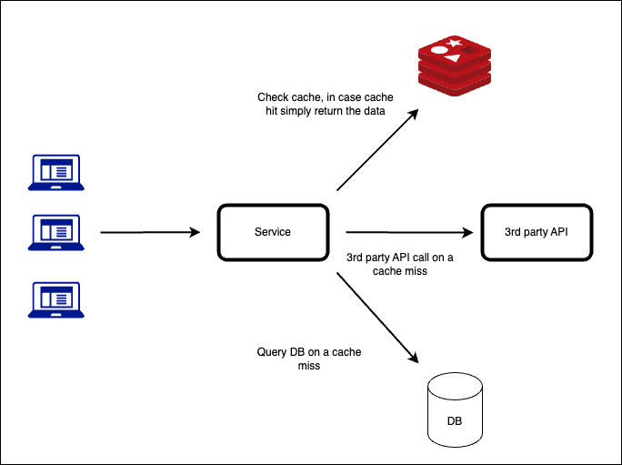
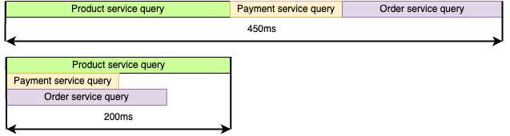

# Ways to improve BE API performance

Ways to improve BE API performance


Authors: Yauheni Navosha
Date: unpublished
Category: backend

tags: backend, api, performance

---

# Introduction

Performance is crucial for modern apps. To achieve high performance of an app you need to utilize resources efficiently,
that in turn leads to cost saving in terms of infrastructure and operational expenses. Also, performance drastically
affects user experience - faster applications result in happier users, higher engagement. The article is an overview of
ways you could boost an API performance.

# Caching



## Use cases and advantages


   To improve backend API performance using caching the general approach is to store in cache expensive or frequent queries to 3rd party APIs, time-consuming and complex database queries.
   For example: 
1. Hotel search queries are quite expensive, caching a request combination for 15 min provides fast initial user experience. For that purpose applying of TTL(time to live, indicates the duration for storing of cached record). On the checkout page the app checks availability again before making payment, but this time using a source of the data.
2. Another example is an e-commerce app. A Product contains rarely changing information like description, price, size etc. A product may be cached for quite long time, but it is a task of the app to manage the cached record on update or delete in source.


The approach has the following advantages:
  * Reduce response time for hundreds of milliseconds;
  * Retrieving data from a cache reduces network latency and overhead for accessing remote resources;
  * Caching can lead to cost saving by reducing the need for expensive infrastructure resources such as CPU, memory, and network.

  Also, developers should consider using local or distributed caches:
  * **Local cache** - refers to storing data on a single machine or within a single application. Good choice for scenarios where data retrieval is limited to one machine or where the volume of data is relatively small.
  * **Distributed cache** - involves storing data across multiple machines or nodes, often in a network. This type of caching is essential for applications that need to scale across multiple servers or are distributed geographically.

## Pitfalls
  * One of the most complex and challenging aspects of caching is deciding when and how to invalidate or update the cached data. Wrong **Caching invalidation** implementation might lead to losing advantages of caching or to providing outdated data to users;
  * Cache consistency - during temporary unavailability of a cache certain updates of data occurs in a source, but not in the cache. After the cache becomes available again the changes must be synchronized. Another separate complex topic is consistency of a distributed cache nodes;
  * Cache poisoning - caches are susceptible to various security threats, such as cache poisoning. Attackers inject malicious data into the cache compromising system integrity and user security, exposing harmful or fraudulent data to users.

# Asynchronous processing

## Use cases and advantages

In web development, performance and responsiveness are intricately linked and play crucial role. Using of asynchronous processing for time-consuming or computation-intensive tasks is beneficial for both of them. For email sending, files processing, logging, where instant response is impossible or not necessary,
asynchronous processing provides an efficient way to handle tasks without delaying other critical operations or blocking the main execution flow. Consider using of Java `CompletableFuture` and `@Async` Spring annotation for asynchronous processing.
Let's demonstrate an example with email sending, using Spring `@Async` annotation. It allows to submit sending of email without waiting a response from actual email processing service.

```java
    @Async
    public void sendEmail(EmailDetails emailDetails){
        try {
            EmailTemplate template = new EmailTemplate();
            template.setFrom(emailDetails.getEmailSender);
            template.setTo(emailDetails.getRecipients());
            template.setText(emailDetails.getMessageBody());
            template.setSubject(emailDetails.getSubject());
            javaMailSender.send(template);
            log.info("Mail sent successfully");
        }catch (MailException exception){
            log.debug("Error during sending an email", exception);
        }
    }
```

But `@Async` has its limitations, for large scale applications with more complex requirements and business logic using message queues like Apache Kafka, RabbitMQ or building an app using Event-Driven architecture is preferable.

## Pitfalls

  * Error handling, especially propagations of such errors across asynchronous boundaries, can be really challenging. Also, improper error handling in asynchronous code can produce silent errors and lead to data corruption, unexpected or misleading behaviour. Consider using exceptions handlers in callbacks and using events for error propagation;
  * Asynchronous programming requires careful management of resources, especially for long-running asynchronous processes. Pay special attention to proper cleanup of resources, possible resource leaking and excess resource consumption;
  * Debugging and testing may require specialized frameworks and techniques.

# Parallel processing

## Use cases and advantages

  During development a service in microservice architecture the following situation may happen:
  a service's task is to query several different services and aggregate data fetched from them. The straightforward approach is to fetch data by querying those services one-by-one,
  but if those calls are independent we might speed up the process by executing the queries in parallel.
  Let's consider an example where a service fetches data from Product, Payment, Order services for further processing. Let's assume that it takes 200ms, 100ms and 150 ms accordingly. 
  The comparison of these two approaches is on the diagram


  
  To implement the parallel approach `CompletableFuture` may be used, CompletableFuture is a class introduced in Java 8 that allows us to write asynchronous, non-blocking code. Let's look at the example:
  ```Java
{
    var productFuture=CompletableFuture.supplyAsync(()->ProductService.fetch(request),exec);
    var paymentFuture=CompletableFuture.supplyAsync(()->PaymentService.fetch(request),exec);
    var orderFuture=CompletableFuture.supplyAsync(()->OrderService.fetch(request),exec);

    CompletableFuture<Void> allFutures=CompletableFuture.allOf(productInfoFuture,paymentFuture,orderFuture);

    try {
        allFutures.get(); // Waits until all tasks are completed
    } catch(InterruptedException|ExecutionException e){
        e.printStackTrace();
    }

    try {
        requiredData.setProductInfo(productFuture.get());
        requiredData.setPaymentInfo(paymentFuture.get());
        requiredData.setOrderInfo(orderFuture.get());
    } catch(InterruptedException|ExecutionException e){
        e.printStackTrace();
    }
    return requiredData;
}
  ```
  
  Virtual threads is a new feature introduced in Java 21. Virtual threads are lightweight threads that reduce the effort of writing, maintaining, and debugging high-throughput concurrent applications.
  Unlike regular thread with virtual threads does not entail any OS-level blocking. Let's try to implement the previous example using Virtual Threads.

  ```Java
{
    Thread t1=startVirtualThread(()->requiredData.setProductInfo(ProductService.fetch(request)));
    Thread t2=startVirtualThread(()->requiredData.setPaymentInfo(PaymentService.fetch(request)));
    Thread t3=startVirtualThread(()->requiredData.setOrderInfo(OrderService.fetch(request)));

    t1.start();t2.start();t3.start();
    t1.join();t2.join();t3.join();
    return requiredData;
}
  ```

## Pitfalls
  * Parallel processing introduces additional complexity to the software design and implementation. Coordinating multiple threads or processes, managing synchronization, and handling communication between parallel tasks can be challenging and error-prone;
  * Parallel processing does not necessarily guarantie linear performance grow. You can not really assume that 100 similar tasks executed using 100 threads will be 10 times faster than 100 tasks, but executed on 10 threads;
  * Debugging and testing may be really challenging since traditional debugging techniques may not be sufficient for investigation concurrency-related issues;
  * Using parallel processing in wrong context. For example before buying a product, application should check that user owes sufficient funds for the purchase. Using of parallel processing in this context may produce a situation when a user is able to buy a good with insufficient funds on his account.

# Payload reduction

To improve performance consider using smaller payloads. Smaller payload lead to faster transmission over network, reduced latency, improves responsiveness.

## Use cases & advantages

One of the ways to reduce a response size is pagination. Using pagination an API respond with small chunks of complete queried dataset. As an example you can apply it for user navigation through content:

```java
    @GetMapping
    public Page<Product> getProducts(@RequestParam(defaultValue = "0") int page,
                                     @RequestParam(defaultValue = "10") int size) {
        
        Pageable pageable = PageRequest.of(page, size);
        d
        return productRepository.findAll(pageable);
    }   
```

Another way for response reduction is response compression. An API compresses a response using a compression algorithm, for instance gzip, and response with its binary representation.
Compressed payload is usually significantly smaller - several megabytes can be compressed to several kilobytes. Spring Boot uses gzip compression by default. 
To use a compression algorithm a client should make a request with the header `Accept-Encoding` to indicate which compression algorithms it supports.
Let's demonstrate how enable an API compression using Spring Boot.
```properties
server.compression.enabled=true
server.compression.mime-types=application/json,application/xml,text/html
server.compression.min-response-size=2048
```

Reducing of API request may be not an easy task, improvement may involve enhancement of an architecture of an app and API redesign. Another, usually a much easier way is to review request payloads of an API 
and try to find out redundant and proper use of HTTP methods to perform operations on resources. For example use `PATCH` instead od `PUT` to apply partial updates to a resource, meaning that a request body contains only fields of a resource that must be updated.
Use `PUT` when you need to replace a resource entirely. Example:

```java
@PatchMapping(path = "/{id}", consumes = "application/json-patch+json")
public ResponseEntity<User> updateUser(@PathVariable String id, @RequestBody JsonPatch patch) {
    User user = userService.findUser(id).orElseThrow(UserNotFoundException::new);
    User userPatched = applyPatchToUser(patch, user);
    userService.updateUser(userPatched);
    return ResponseEntity.ok(userPatched);
}
```

## Pitfalls
 * Not properly implemented pagination may have issues with consistency and integrity of data, particularly in data-intensive apps.
 * Using compression for small-sized responses or already compressed data. While compression reduces the size of HTTP responses it increases processing time, therefore for mentioned cases compression may affect performance in negative way;
 * Using `PATCH` brings additional complexity, indeed testing. Also, the HTTP method may not be supported by all servers or clients;

# Using of Circuit Breaker

## Use cases & advantages

Circuit Breaker is a design pattern, despite the fact that its main purpose is to enhance the resilience of a system, implementation of the pattern can lead to performance improvements in certain scenarios:

When a remote service experiencing a degradation, the application fails fast, preventing resource-exhaustion issues and reducing the time spent waiting for unresponsive or faulty service. At the same time circuit breaker can periodically check to see if the service is healthy and get the access to the service back if in positive scenario. 
Also, by timing out and failing fast, the circuit breaker pattern allows to fail gracefully. Application can avoid unnecessary delays by implementing appropriate fallback strategies like using default values or cached data.

Let's demonstrate using of Circuit Breaker of Resilience4j library. Enabling it simply requires putting `@CircuitBreaker` annotation on top of a method and configuration of properties in `application.yml` or `bootstrap.yml` file:

``` java
@CircuitBreaker(name="someService")
public List<Item> getSomeItems(String id) {
  ....
}
```

```yaml
resilience4j.circuitbreaker:
  instances:
    someService:
      failureRateThreshold: 50
      waitDurationOpenState: 10s
      .....
  
```

## Pitfalls

  * Tuning the circuit breakers thresholds and timeouts is crucial, but quite complex task. Without proper configuration such issues as breaking early(false negative scenario) are possible, leading to degradation of a healthy service;
  * Due to overhead implementation may negatively impact performance in high-throughput scenarios.
