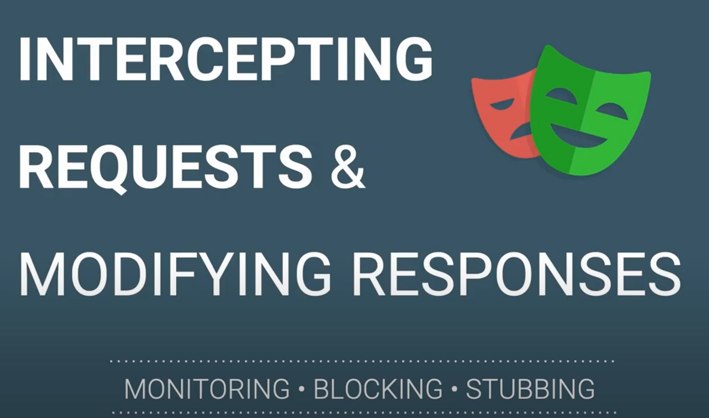

# Web Test Automation: Intercepting/Mocking Network Calls With Playwright

Nowadays, QAs are much more into test automation to improve the quality and efficiency of the testing. Due to the technical limitations, the test cases are labelled as Not Possible To Automate due to .



Authors: Dilshan Fernando
Date: unpublished
Category: qa

tags: playwright

---
This blog provides a solid solution where tester use a proxy tool to intercept an API request/response to perform validations on a web app. Playwright provides APIs to monitor and intercept browser network traffic, both HTTP and HTTPS. Any requests a page does, including XHRs and fetch requests, can be tracked, modified, and handled.
As the next step, look at the benefits and possibilities of intercepting and mocking HTTP requests/responses  in your Playwright test.

## What are the benefits of this?

1. During manual web testing, testers use proxy tools such as Proxyman and Charles to capture the traffic between your app and the SSL Web Server. Breakpoint Tool helps you to intercept Requests/Responses Data on the fly without changing any client code. If the tester can automate these manual steps, then everyone knows how it would be beneficial for the final quality of the app.

2. No need to maintain mock servers or depend on client test data 100%. While using the client data tester can,
   - Control the quality of test data Increase data volume/varieties
   - Readiness and availability of data
3. At last, the automation coverage can be increased by automating manual test cases which depends on the proxy tools.

---

## Next look at the implementation

Playwright allows you to intercept network requests by using the route method. You can use this method to change or log the network traffic, or even block certain requests. 

Playwright provide 5 methods,
- abort -> Aborts the route's request.
- continue -> Continue route's request with optional overrides.
- fallback -> When several routes match the given pattern, they run in the order opposite to their registration. That way the last registered route can always override all the previous ones.
- fetch -> Performs the request and fetches the result without fulfilling it so that the response can be modified and then fulfilled.
- fulfill -> Fulfills route's request with a given response.

### How to integrate this approach into your test framework?

Next look at the `netwrokInterceptor.ts`

```typescript
import { Page } from "@playwright/test";
import * as fs from 'fs';
import * as path from 'path';

export class NetworkInterceptor {
  constructor(private page: Page) { }
  /**
   * 
   * @param urlToIntercept Response URL which need to Mock
   * @param options [filePath] relative path for the Json response body
   * @param options [statusCode] Mock response status code 
   */
  async interceptResponse(urlToIntercept: string, options?: { filePath?: string, statusCode?: number }) {
    var newResponseBody = readJsonFile(options.filePath);

    await this.page.route(urlToIntercept, async (route) => {
      console.log('Intercepted response:', route.request().url());
      // Make the original request
      const response = await route.fetch();
      // if mock response code is unavialble, then use the original response code
      const mockResponsecode = (typeof options.statusCode !== 'undefined') ? options.statusCode : Number(response.status)
      // Replace the response with the modified data
      route.fulfill({
        status: mockResponsecode,
        headers: {
          'Content-Type': 'application/json',
        },
        body: JSON.stringify(newResponseBody),
      });
    });
  }
  /**
   * 
   * @param urlToIntercept 
   * @param options [filePath] relative path for the Json request body
   */
  async interceptRequest(urlToIntercept: string, options?: { filePath?: string}) {
    var newRequestBody = readJsonFile(options.filePath);

    await this.page.route(urlToIntercept, async (route) => {
      console.log('Intercepted request:', route.request().url());
      // Replace the request with the modified data
      route.continue({
        postData: newRequestBody
      });
    });
  }
}

/**
 * 
 * @param filePath  relative location of the json file
 * @returns JSON Object
 */
function readJsonFile(filePath: string) {
  const rawData = fs.readFileSync(path.resolve(__dirname, filePath), 'utf-8');
  return JSON.parse(rawData);
}
```
Let's go through the above implementation at a high level.

The method `InterceptResponse` is a generic method that can be used or modified (based on the use case) to intercept any response you want.
The method `InterceptRequest` is a generic method that can be used or modified (based on the use case) to intercept any request you want.

> 💡
> You only need to add a new parameter to the option based on what you need. This way you can modify the same method without breaking the existing code.

### How to use this new method in Test class?

The tricky part is, how to invoke this method in your test. The most common mistakes are,

```typescript
await identityPage.loginButton.click()
await page.waitForResponse(urlToIntercept)
```
OR
```typescript
await page.waitForResponse(urlToIntercept)
await identityPage.loginButton.click()
```
In the first approach, once the login button is clicked request response will already happen, and the test will be waiting for a response.

In the second approach, the request has not happened because the lick event hasn't happened yet. 

To resolve this you must use `await Promise.all([]);` to wait for both interactions to resolve.

```typescript
const filePath = '../data/json-files/internal-server-error.json'
const urlToIntercept = env.BASE_URL + '/api/transaction-manager/client-api/v2/transactions?size=5&orderBy=bookingDate&direction=DESC';
networkInterceptor.interceptResponse(urlToIntercept, { filePath, statusCode: 500 })

await Promise.all([
    page.waitForResponse(urlToIntercept),
    identityPage.loginButton.click(),
]);
```


> ✏️
> You need to add the server error JSON response to the project and replace the value for `filepath`

## Conclusion

The [page.route](https://playwright.dev/docs/api/class-page#page-route) method of Playwright allows you to intercept HTTP requests and return a mocked response. Because you are fully in control of the response, this enables you to create edge cases to cover all the possible scenarios quickly without introducing a lot of overhead.
The Playwright API is flexible enough to be used in different ways. You can just create a mocked response, return an error, or you can make the original request and alter the response.

## References
Official documentation for [Network](https://playwright.dev/docs/network) interception.


