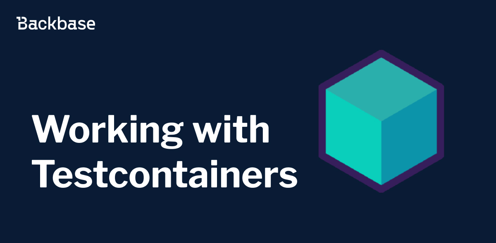

# Working with test containers


Framework that simplifies the process of setting up, managing, and tearing down containerized environments for integration testing.





Authors: Yauheni Navosha
Date: unpublished
Category: backend


tags: backend, tests, testing, integration testing, docker, containers

---

## Introduction


We are going to create a Spring Boot project using Kafka, Spring Data JPA, MySQL database, Backbase [events](https://backbase.io/developers/documentation/backend-devkit/17.0.0/messaging/use-events/) for our scenario, where we implement a service which receives an event payload and persists the event data in the database.
Then we will write an integration test using the Testcontainers Kafka and MySQL modules altogether with [Awaitility](http://www.awaitility.org/)


## Prerequisites
* Java 21+
* Maven
* Your favorite IDE
* A docker environment supported by [testcontainers](https://java.testcontainers.org/supported_docker_environment/).


## Getting started
Let’s consider the following scenario:
We have a product that will be stored in MySQL database. We are going to update it on a received event from Kafka.


Let’s create a spring boot service which will be responsible for handling the scenario. I use the [Backbase service toolkit](https://engineering.backbase.com/intellij-docs/#create-a-new-backbase-project) for this purpose.


Required dependencies:


```xml
       <dependency>
           <groupId>com.mysql</groupId>
           <artifactId>mysql-connector-j</artifactId>
           <scope>runtime</scope>
       </dependency>


       <dependency>
           <groupId>org.springframework.boot</groupId>
           <artifactId>spring-boot-starter-data-jpa</artifactId>
       </dependency>


       <dependency>
           <groupId>org.projectlombok</groupId>
           <artifactId>lombok</artifactId>
           <version>1.18.32</version>
           <scope>provided</scope>
       </dependency>


       <dependency>
           <groupId>org.springframework.cloud</groupId>
           <artifactId>spring-cloud-stream-binder-kafka</artifactId>
       </dependency>


       <dependency>
           <groupId>com.backbase.buildingblocks</groupId>
           <artifactId>service-sdk-starter-test</artifactId>
           <scope>test</scope>
       </dependency>


       <dependency>
           <groupId>org.springframework.boot</groupId>
           <artifactId>spring-boot-testcontainers</artifactId>
           <scope>test</scope>
       </dependency>


       <dependency>
           <groupId>org.testcontainers</groupId>
           <artifactId>junit-jupiter</artifactId>
           <scope>test</scope>
       </dependency>
       <dependency>
           <groupId>org.testcontainers</groupId>
           <artifactId>kafka</artifactId>
           <scope>test</scope>
       </dependency>
       <dependency>
           <groupId>org.testcontainers</groupId>
           <artifactId>mysql</artifactId>
           <scope>test</scope>
       </dependency>
```


## Persistence implementation
Next we will create JPA entity:


```java
@AllArgsConstructor
@Data
@NoArgsConstructor
@Entity
@Table(name = "products")
public class Product {
   @Id
   @GeneratedValue(strategy = GenerationType.IDENTITY)
   private Long id;


   @Column(nullable = false, unique = true)
   private String code;


   @Column(nullable = false)
   private String name;


   @Column(nullable = false)
   private BigDecimal price;
}
```


Following SQL script must be placed under _/src/main/resources/schema.sql_


```sql
create table products (
                         id int NOT NULL AUTO_INCREMENT,
                         code varchar(255) not null,
                         name varchar(255) not null,
                         price numeric(5,2) not null,
                         PRIMARY KEY (id),
                         UNIQUE (code)
);
```


Also, you need to put the following property to `application.yaml` or `application.properties` to initialize the script on an app start
```yaml
spring:
 sql:
   init:
     mode: always
```


One more thing you are required is Spring Data JPA repository:


```java
public interface ProductRepository extends JpaRepository<Product, Long> {
 @Modifying
 @Query("update Product p set p.price = :price where p.code = :productCode")
 void updateProductPrice(
   @Param("productCode") String productCode,
   @Param("price") BigDecimal price
 );


 Optional<Product> findByCode(String code);
}
```


That is pretty much it from database perspective, let's configure sending and receiving Kafka messages using Backbase [events](https://backbase.io/developers/documentation/backend-devkit/17.0.0/messaging/use-events/) for our scenario.


## Kafka events using Backbase events


First thing first we need some event class. We are going to create it using the configuration `jsonschema-events-maven-plugin`:


```xml
<plugin>
 <groupId>com.backbase.codegen</groupId>
 <artifactId>jsonschema-events-maven-plugin</artifactId>
 <executions>
   <execution>
     <phase>generate-sources</phase>
     <goals>
       <goal>events-generation</goal>
     </goals>
   </execution>
 </executions>
 <configuration>
   <inputFile>${project.basedir}/src/main/resources/events</inputFile>
   <outputFile>${project.build.directory}/generated-sources/events</outputFile>
   <basePackageName>${project.groupId}</basePackageName>
   <packageName>testcontainerssamples</packageName>
   <packageVersion>1</packageVersion>
   <useJavaTime>true</useJavaTime>
   <generatedResourcesDirectory>${project.build.directory}/generated-resources
   </generatedResourcesDirectory>
   <generatedSpringFactoriesDir>${project.build.directory}/generated-spring-factories
   </generatedSpringFactoriesDir>
 </configuration>
</plugin>
```


Also, it is required to place the product-price-changed-event.json file to the directory `/src/main/resources/events/` :


```json
{
 "$schema": "http://json-schema.org/draft-04/schema#",
 "groupId": "demo",
 "destination": "product-price-changes",
 "type": "object",
 "properties": {
   "id": {
     "type": "integer"
   },
   "code": {
     "type": "string"
   },
   "name": {
     "type": "string"
   },
   "price": {
     "type": "string"
   }
 },
 "required": [
   "id"
 ]
}
```


Use `mvn jsonschema-events:events-generation -f pom.xml` to generate event from the json. It will be placed on `target/generated-sources/` directory. Make sure you included it as source folder in your IDE.


Next step is to create events emitter and events handler:


```java
import com.backbase.buildingblocks.backend.communication.event.EnvelopedEvent;
import com.backbase.buildingblocks.backend.communication.event.proxy.EventBus;
import org.springframework.beans.factory.annotation.Autowired;
import org.springframework.stereotype.Service;


@Service
public class EventEmitter<T> {


 private final EventBus eventBus;


 @Autowired
 public EventEmitter(EventBus eventBus) {
   this.eventBus = eventBus;
 }


 public void sendMessage(T event) {
   EnvelopedEvent<T> envelopedEvent = new EnvelopedEvent<>();
   envelopedEvent.setEvent(event);
   eventBus.emitEvent(envelopedEvent);
 }
}
```


```java
import com.backbase.buildingblocks.backend.communication.event.EnvelopedEvent;
import com.backbase.buildingblocks.backend.communication.event.handler.EventHandler;
import com.backbase.testcontainers.repository.ProductRepository;
import com.backbase.testcontainerssamples.event.spec.v1.ProductPriceChangedEvent;
import java.math.BigDecimal;
import lombok.extern.slf4j.Slf4j;
import org.springframework.beans.factory.annotation.Autowired;
import org.springframework.stereotype.Component;
import org.springframework.transaction.annotation.Transactional;


@Component
@Slf4j
public class ProductPriceChangedEventHandler implements EventHandler<ProductPriceChangedEvent> {


 private final ProductRepository productRepository;


 @Autowired
 public ProductPriceChangedEventHandler(ProductRepository productRepository) {
   this.productRepository = productRepository;
 }


 @Override
 @Transactional
 public void handle(
   EnvelopedEvent<ProductPriceChangedEvent> envelopedEvent) {
   ProductPriceChangedEvent event = envelopedEvent.getEvent();
   productRepository.updateProductPrice(event.getCode(), new BigDecimal(event.getPrice()));
 }
}
```


Following properties are also must be included in the `properties.yaml`:
```yaml
backbase:
 activemq:
   enabled: false
spring:
 cloud:
   stream:
     default-binder: kafka
     kafka:
       binder:
         brokers: localhost:9092
```


## Write integration test


We are going to write a test for the events emitter by sending a message and verify updated product price in the database. We will use Testcontainers library to spin up Kafka and MySQL database
as Docker containers.


```java


import static java.util.concurrent.TimeUnit.SECONDS;
import static org.assertj.core.api.Assertions.assertThat;
import static org.testcontainers.shaded.org.awaitility.Awaitility.await;


import com.backbase.testcontainers.domain.Product;
import com.backbase.testcontainers.repository.ProductRepository;
import com.backbase.testcontainerssamples.event.spec.v1.ProductPriceChangedEvent;
import java.math.BigDecimal;
import java.time.Duration;
import java.util.Optional;
import lombok.extern.slf4j.Slf4j;
import org.junit.jupiter.api.BeforeEach;
import org.junit.jupiter.api.Test;
import org.springframework.beans.factory.annotation.Autowired;
import org.springframework.boot.test.context.SpringBootTest;
import org.springframework.test.context.ActiveProfiles;
import org.springframework.test.context.DynamicPropertyRegistry;
import org.springframework.test.context.DynamicPropertySource;
import org.springframework.test.context.TestPropertySource;
import org.testcontainers.containers.KafkaContainer;
import org.testcontainers.junit.jupiter.Container;
import org.testcontainers.junit.jupiter.Testcontainers;
import org.testcontainers.utility.DockerImageName;


@SpringBootTest
@TestPropertySource(
 properties = {
   "spring.kafka.consumer.auto-offset-reset=earliest",
   "spring.datasource.url=jdbc:tc:mysql:8.0.32:///db",
 }
)
@Testcontainers
@ActiveProfiles("it")
@Slf4j
public class ProductPriceChangedEventHandlerTest {
 @Container
 static final KafkaContainer kafka = new KafkaContainer(
   DockerImageName.parse("confluentinc/cp-kafka:7.5.1")
 );


 @DynamicPropertySource
 static void overrideProperties(DynamicPropertyRegistry registry) {
   registry.add("spring.kafka.bootstrap-servers", kafka::getBootstrapServers);
 }


 @Autowired
 private EventEmitter<ProductPriceChangedEvent> productPriceChangedEventEventEmitter;


 @Autowired
 private ProductRepository productRepository;


 @BeforeEach
 void setUp() {
   Product product = new Product(null, "P100", "Product One", BigDecimal.TEN);
   productRepository.save(product);
 }


 @Test
 void shouldHandleProductPriceChangedEvent() {
   ProductPriceChangedEvent event = new ProductPriceChangedEvent();
   event.withPrice("14.50")
     .withCode("P100");


   productPriceChangedEventEventEmitter.sendMessage(event);


   await()
     .pollInterval(Duration.ofSeconds(3))
     .atMost(10, SECONDS)
     .untilAsserted(() -> {
       Optional<Product> optionalProduct = productRepository.findByCode("P100");


       assertThat(optionalProduct).isPresent();
       log.info("Product {}", optionalProduct.get());
       assertThat(optionalProduct.get().getCode()).isEqualTo("P100");
       assertThat(optionalProduct.get().getPrice())
         .isEqualTo(new BigDecimal("14.50"));
     });
 }
}
```


* `@SpringBootTest` load the complete Spring application context
* We have configured the Testcontainers special JDBC URL to spin up MySQL container and configure it as a DataSource with Spring Boot application context
* We have used the Testcontainers JUnit 5 Extension annotations @Testcontainers and @Container to spin up a Kafka container and registered the bootstrap-servers location using DynamicPropertySource mechanism.
* We have created a Product record in the database before running the test using the @BeforeEach callback method.
* During the test we sent a message using `EventEmitter`.
* As Kafka message processing is an asynchronous process, we are using the Awaitility library to check whether the product price is updated in the database to the expected value or not with an interval of 3 seconds waiting up to a maximum of 10 seconds. If the message is consumed and processed within 10 seconds the test will pass, otherwise the test will fail.
* Also, notice that we have configured the property spring.kafka.consumer.auto-offset-reset to earliest so that the listener will consume the messages even if the message is sent to the topic before the listener is ready. This setting is helpful for running tests.
